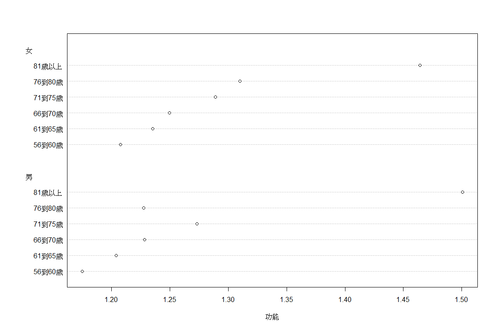
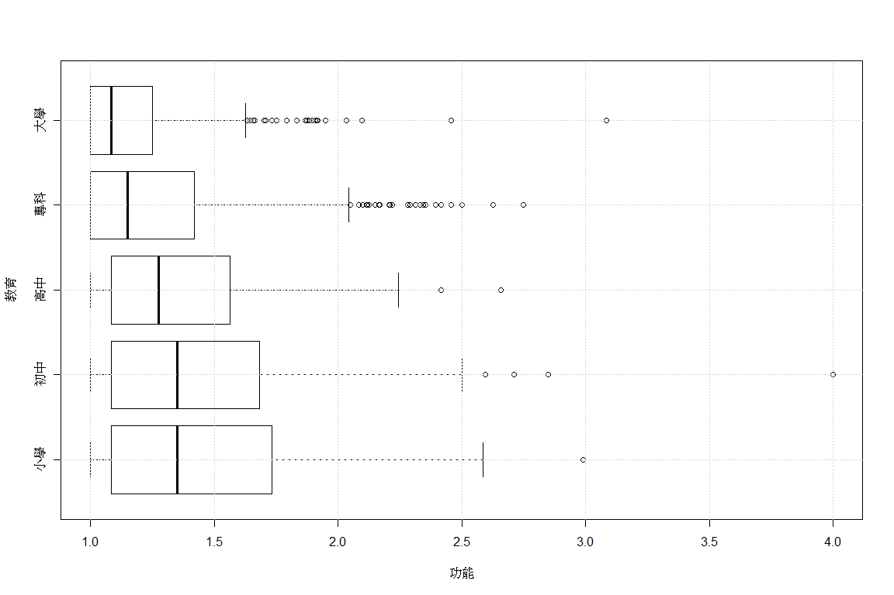
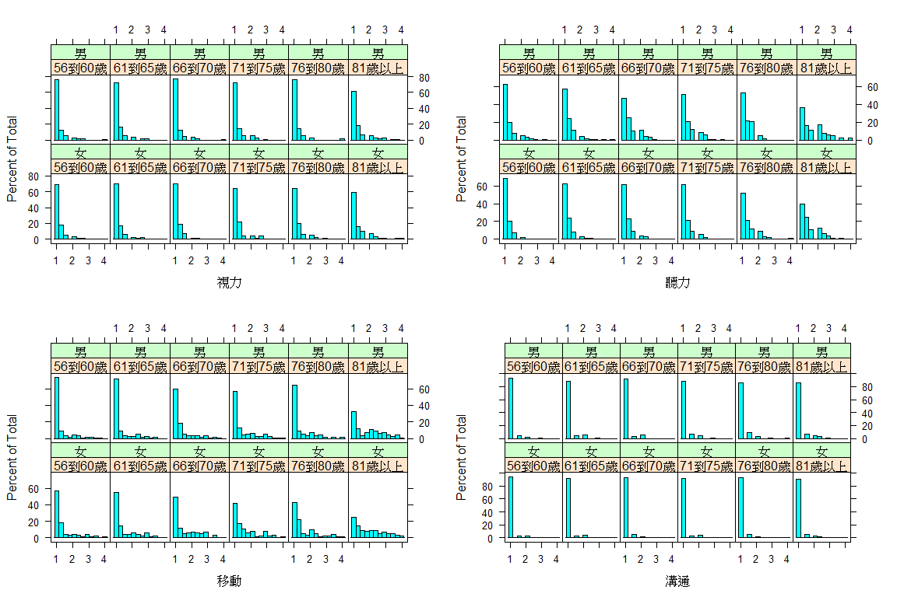
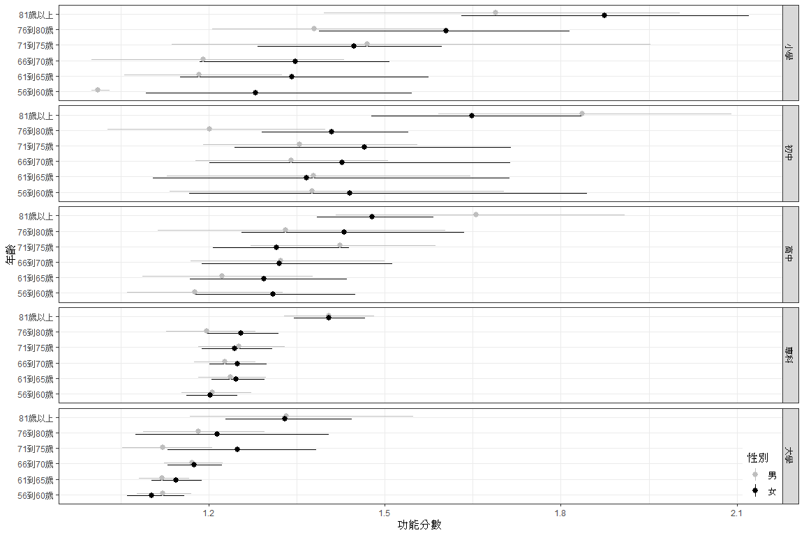
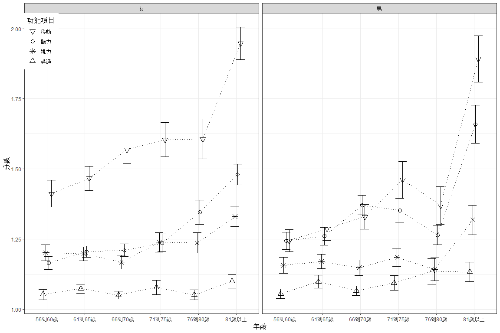

R在行為科學之應用:第一章
================
鄭中平、許清芳
2019 九月 03

``` r
#我在哪裡? - current working directory
getwd()
```

    [1] "C:/Users/Ching-Fan Sheu/Desktop"

### 讀取檔案、提取資料與製造變項

資料來自於 NHIS 2010 調查,取 1955 年以前出生者（55歲以上） 視力困難、聽力困難、移動困難與溝通困難變項，分數越高越有困難

資料檔名: Quality\_of\_Life.txt

這是一般 TXT 檔，檔頭有變項名稱

``` r
#檔案地址
fLoc <- "http://myweb.ncku.edu.tw/~cpcheng/Rbook/01/data/Quality_of_Life.txt"
```

``` r
# 讀取檔案
dta <- read.table(file = fLoc, header = TRUE)
```

### 資料類型

``` r
#dta 的類型是資料框架（data frame）
class(dta)
```

    [1] "data.frame"

看看dta維度: 多少行、多少行列(變項).

``` r
dim(dta)
```

    [1] 2077    7

``` r
#利用names看看變項名稱
names(dta)
```

    [1] "性別" "教育" "年齡" "視力" "聽力" "移動" "溝通"

看前六筆

``` r
#程式報表1.1
head(dta)
```

``` 
  性別 教育     年齡 視力 聽力 移動 溝通
1   女 專科 56到60歲 1.00 1.33  1.2  1.0
2   女 大學 66到70歲 1.00 1.33  1.2  1.5
3   男 大學 76到80歲 1.00 1.33  1.0  1.0
4   女 專科 81歲以上 2.67 2.00  1.0  1.0
5   男 專科 71到75歲 1.67 2.33  1.0  1.0
6   女 大學 56到60歲 1.00 1.00  1.0  1.0
```

``` r
#看看第一列第一欄對應資料
dta[1, 1]
```

    [1] 女
    Levels: 女 男

這是類別資料

``` r
#看看第九列，這是資料框架
class(dta[9, ])
```

    [1] "data.frame"

``` r
#看看第一欄，這「不是」資料框架，是類別
class(dta[,1])
```

    [1] "factor"

``` r
#前者是類別變項，後者是資料框架
class(dta[,'教育'])
```

    [1] "factor"

``` r
class(dta['教育'])
```

    [1] "data.frame"

``` r
#還是資料框架
class(dta[5:7, c('視力', '聽力')])
```

    [1] "data.frame"

檢視資料結構

``` r
#程式報表1.2
str(dta)
```

    'data.frame':   2077 obs. of  7 variables:
     $ 性別: Factor w/ 2 levels "女","男": 1 1 2 1 2 1 2 1 1 1 ...
     $ 教育: Factor w/ 5 levels "大學","小學",..: 5 1 1 5 5 1 5 5 2 5 ...
     $ 年齡: Factor w/ 6 levels "56到60歲","61到65歲",..: 1 3 5 6 4 1 5 6 1 1 ...
     $ 視力: num  1 1 1 2.67 1.67 1 1 3.67 1.33 1 ...
     $ 聽力: num  1.33 1.33 1.33 2 2.33 1 1.33 1.33 1 1 ...
     $ 移動: num  1.2 1.2 1 1 1 1 1 2.33 1.2 1 ...
     $ 溝通: num  1 1.5 1 1 1 1 1 1 1 1 ...

看看類別變項的屬性

``` r
#這是五個水準類別變項
attributes(dta[, '教育'])
```

    $levels
    [1] "大學" "小學" "初中" "高中" "專科"
    
    $class
    [1] "factor"

用table指令檢視類別變項分佈

``` r
#程式報表1.3
table(dta[, '教育'])
```

``` 

大學 小學 初中 高中 專科 
 466  107  163  188 1153 
```

將類別變項轉成數值變項，再利用table

``` r
#程式報表1.3
table(as.numeric(dta[, '教育']))
```

``` 

   1    2    3    4    5 
 466  107  163  188 1153 
```

### 指令作用結果視作用物件而定

指令summary是常用指令，可以用在不同物件上

這是用在資料框架上

``` r
#程式報表1.4
summary(dta['教育'])
```

``` 
   教育     
 大學: 466  
 小學: 107  
 初中: 163  
 高中: 188  
 專科:1153  
```

這是用在類別變項上

``` r
#程式報表1.4
summary(dta[, '教育'])
```

    大學 小學 初中 高中 專科 
     466  107  163  188 1153 

``` r
#第一個是數值，第二個是資料框架
class(dta[, '視力'])
```

    [1] "numeric"

``` r
class(dta['視力'])
```

    [1] "data.frame"

``` r
#指令t用來轉置矩陣，資料框架被轉成矩陣了
class(t(dta['視力']))
```

    [1] "matrix"

兩種寫法製造平均數

``` r
#很直覺，不過如果有遺漏值就麻煩了
dta$功能 <- (dta$視力 + dta$聽力 + dta$移動 + dta$溝通)/4;
head(dta$功能)
```

    [1] 1.133 1.258 1.083 1.667 1.500 1.000

``` r
#有遺漏值會警告我們
tail(dta$功能 <- rowMeans(dta[, 4:7]))
```

    [1] 1.000 1.145 1.442 1.250 1.000 1.095

### 基本統計量（示範應用函數）

看看資料基本統計

``` r
#程式報表1.5
summary(dta)
```

``` 
 性別        教育            年齡          視力           聽力     
 女:1201   大學: 466   56到60歲:393   Min.   :1.00   Min.   :1.00  
 男: 876   小學: 107   61到65歲:456   1st Qu.:1.00   1st Qu.:1.00  
           初中: 163   66到70歲:383   Median :1.00   Median :1.00  
           高中: 188   71到75歲:283   Mean   :1.21   Mean   :1.30  
           專科:1153   76到80歲:217   3rd Qu.:1.33   3rd Qu.:1.33  
                       81歲以上:345   Max.   :4.00   Max.   :4.00  
      移動           溝通           功能     
 Min.   :1.00   Min.   :1.00   Min.   :1.00  
 1st Qu.:1.00   1st Qu.:1.00   1st Qu.:1.00  
 Median :1.00   Median :1.00   Median :1.16  
 Mean   :1.51   Mean   :1.08   Mean   :1.28  
 3rd Qu.:1.80   3rd Qu.:1.00   3rd Qu.:1.42  
 Max.   :4.00   Max.   :4.00   Max.   :4.00  
```

計算健康情形標準差

``` r
sd(dta$功能)
```

    [1] 0.3303

``` r
#利用 with 會讓指令比較好寫好讀
with(dta, sd(功能))
```

    [1] 0.3303

### 安裝套件 ，載入套件

注意，安裝只需要一次，但載入則是每次

``` r
#先安裝再載入套件 
install.packages("moments", repos='https://cran.rstudio.com/')
```

    package 'moments' successfully unpacked and MD5 sums checked
    
    The downloaded binary packages are in
        C:\Users\Ching-Fan Sheu\AppData\Local\Temp\RtmpMD4AVv\downloaded_packages

``` r
#
library(moments)
```

計算偏態

``` r
with(dta, skewness(功能))
```

    [1] 1.822

### 矢量化運算

一次計算所有平均數

``` r
#一次計算所有平均數
sapply(dta[, -c(1:3)], mean)
```

``` 
 視力  聽力  移動  溝通  功能 
1.208 1.302 1.515 1.078 1.276 
```

Conditional means

``` r
aggregate(cbind(視力, 聽力, 移動, 溝通) ~ 教育, data = dta, mean)
```

``` 
  教育  視力  聽力  移動  溝通
1 大學 1.142 1.243 1.262 1.036
2 小學 1.401 1.294 1.913 1.173
3 初中 1.355 1.480 1.891 1.181
4 高中 1.243 1.423 1.704 1.104
5 專科 1.191 1.281 1.497 1.067
```

### 定義一個函數

可以同時算出平均數、標準差、偏態與峰度

一次計算多個變項平均數、標準差、偏態與峰度

``` r
#程式報表1.6
my_summary <- function(x) {
 require(moments)
 funs <- c(mean, sd, skewness, kurtosis)
 sapply(funs, function(f) f(x, na.rm = TRUE))
}
sapply(dta[, c(4:8)], my_summary)
```

``` 
        視力   聽力   移動    溝通   功能
[1,]  1.2082 1.3018 1.5153  1.0778 1.2758
[2,]  0.4254 0.4604 0.7489  0.2909 0.3303
[3,]  3.0325 2.1140 1.4312  4.9740 1.8217
[4,] 14.4584 8.6590 3.9950 34.3036 7.7898
```

計算不同教育程度健康功能標準差（兩種寫法）

``` r
tapply(dta$功能, dta$年齡, sd)
```

    56到60歲 61到65歲 66到70歲 71到75歲 76到80歲 81歲以上 
      0.2916   0.2925   0.2704   0.3218   0.3058   0.4122 

``` r
with(dta, tapply(功能, 年齡, sd))
```

    56到60歲 61到65歲 66到70歲 71到75歲 76到80歲 81歲以上 
      0.2916   0.2925   0.2704   0.3218   0.3058   0.4122 

把不同性別、教育者平均數算出來（兩種寫法）

第二種寫法把輸出放到 hlth 物件了，沒有輸出到螢幕

``` r
#程式報表1.7
with(dta, aggregate(dta[, 4:8], by = list(性別, 年齡), FUN = mean))
```

``` 
   Group.1  Group.2  視力  聽力  移動  溝通  功能
1       女 56到60歲 1.201 1.165 1.412 1.052 1.207
2       男 56到60歲 1.156 1.244 1.245 1.055 1.175
3       女 61到65歲 1.197 1.205 1.467 1.073 1.235
4       男 61到65歲 1.170 1.260 1.287 1.098 1.204
5       女 66到70歲 1.168 1.210 1.569 1.050 1.249
6       男 66到70歲 1.147 1.371 1.329 1.066 1.228
7       女 71到75歲 1.238 1.236 1.604 1.077 1.289
8       男 71到75歲 1.185 1.352 1.461 1.094 1.273
9       女 76到80歲 1.236 1.346 1.606 1.051 1.310
10      男 76到80歲 1.142 1.264 1.370 1.135 1.228
11      女 81歲以上 1.330 1.480 1.948 1.099 1.464
12      男 81歲以上 1.318 1.659 1.893 1.133 1.501
```

``` r
hlth <- aggregate(cbind(視力, 聽力, 移動, 溝通, 功能) ~ 性別 + 年齡, 
                       data = dta, mean)
```

``` r
#命名 hlth 的前兩欄
names(hlth)[1:2] <- c('性別', '年齡')
```

不同性別與年齡的健康功能圖

``` r
#圖1.1
with(hlth, dotchart(t(功能), group = 性別, labels = 年齡, xlab = '功能'))
```



依移動排序，可以看到男性移動困難退化的較慢

``` r
#程式報表1.8
hlth[order(hlth$移動), c(1:2, 5)]
```

``` 
   性別     年齡  移動
2    男 56到60歲 1.245
4    男 61到65歲 1.287
6    男 66到70歲 1.329
10   男 76到80歲 1.370
1    女 56到60歲 1.412
8    男 71到75歲 1.461
3    女 61到65歲 1.467
5    女 66到70歲 1.569
7    女 71到75歲 1.604
9    女 76到80歲 1.606
12   男 81歲以上 1.893
11   女 81歲以上 1.948
```

### 繪圖顯示

``` r
#先將教育程度水準重排
dta$教育 <- factor(dta$教育, levels = c('小學', '初中', '高中', '專科', '大學'))
```

不同教育水準健康功能盒鬚圖

把資料改成水平，更容易比較

這是直接針對原始資料，而非統計量畫圖

``` r
#圖1.2
plot(功能 ~ 教育, data = dta, horizontal = T)
#加上格線，有助比較
grid()
```



``` r
#載入 lattice，準備畫圖
library(lattice)
```

``` r
#取出四個要畫圖的變項
v4 <- dta[, 4:7]
```

``` r
#把變項年齡與性別上的直方圖記下來
p <- lapply(names(v4), function(x) histogram( ~ v4[x] | 年齡 + 性別, data = dta,
            xlab = x )) 
```

利用 gridExtra 排一下四張圖

``` r
#圖1.3
#install.packages("gridExtra",  repos='https://cran.rstudio.com/')
library(gridExtra)
grid.arrange(p[[1]], p[[2]], p[[3]], p[[4]], nrow = 2, ncol = 2)
```



繪製不同年齡生理健康的平均數

加上利用拔靴法得到的平均數信賴區間

``` r
# 先檢查再安裝
# 載進 ggplot2 in tidyverse，準備畫圖
# Hmisc提供額外功能
if (!require(pacman)) install.packages("pacman")
```

    Loading required package: pacman

``` r
# 載入套件
pacman::p_load(tidyverse, Hmisc, here)
```

``` r
#調整圖形，避免重疊
pd <- position_dodge(width = .3)
```

``` r
#圖1.4
ggplot(data = dta, aes(x = 年齡, y = 功能, color = 性別) ) +
 stat_summary(fun.data = 'mean_cl_boot', position = pd) +
 facet_grid(教育 ~ . ) +
 labs(x = '年齡', y = '功能分數') +
 coord_cartesian(ylim = range(dta['功能'])) +
 coord_flip() +
 scale_color_manual(values = c('black', 'gray'), 
                    guide = guide_legend(title = '性別', reverse = TRUE)) +
 theme_bw() +
 theme(legend.justification = c(1, 0), legend.position = c(1, 0))
```



### 示範資料重新結構

把資料由寬形變長形

``` r
dtal <- gather(dta, key = '功能項目', value = '分數', 4:7)
```

看看資料

``` r
#程式報表1.9
head(dtal)
```

``` 
  性別 教育     年齡  功能 功能項目 分數
1   女 專科 56到60歲 1.133     視力 1.00
2   女 大學 66到70歲 1.258     視力 1.00
3   男 大學 76到80歲 1.083     視力 1.00
4   女 專科 81歲以上 1.667     視力 2.67
5   男 專科 71到75歲 1.500     視力 1.67
6   女 大學 56到60歲 1.000     視力 1.00
```

不同年齡性別各功能項目平均數

``` r
#圖1.5
p <- ggplot(data = dtal, aes(x = 年齡, y = 分數, 
       shape = reorder(功能項目, 分數, mean),  group = reorder(功能項目, 分數))) +
 stat_summary(fun.data = mean_se, geom = 'errorbar', position = pd) +
 stat_summary(fun.y = mean, geom = 'point', position = pd, size = 3) +
 stat_summary(fun.y = mean, geom = 'line', position = pd, linetype = 'dotted') +
 facet_grid( . ~  性別) +
 labs(x = '年齡', y = '分數') +
 scale_shape_manual(values = c(2, 8, 1, 6), 
                    guide = guide_legend(title = '功能項目', reverse = TRUE)) +
 theme_bw() +
 theme(legend.justification = c(0, 1), legend.position = c(0, 1))
#
print(p)
```



不同性別在功能上平均數檢定（兩種寫法）

``` r
#程式報表1.10
t.test(功能 ~ 性別, data = dta)
```

``` 

    Welch Two Sample t-test

data:  功能 by 性別
t = 2.6, df = 1920, p-value = 0.008
alternative hypothesis: true difference in means is not equal to 0
95 percent confidence interval:
 0.00996 0.06714
sample estimates:
mean in group 女 mean in group 男 
           1.292            1.253 
```

``` r
with(dta, t.test(功能 ~ 性別))
```

``` 

    Welch Two Sample t-test

data:  功能 by 性別
t = 2.6, df = 1920, p-value = 0.008
alternative hypothesis: true difference in means is not equal to 0
95 percent confidence interval:
 0.00996 0.06714
sample estimates:
mean in group 女 mean in group 男 
           1.292            1.253 
```

One-way analysis of variance

``` r
anova(lm(功能 ~ 教育, data = dta))
```

``` 
Analysis of Variance Table

Response: 功能
            Df Sum Sq Mean Sq F value Pr(>F)
教育         4   16.7    4.18    41.3 <2e-16
Residuals 2072  209.7    0.10               
```

### 存檔, 存圖

``` r
dir.create("ch01")
dir.create(here("ch01", "data"))
write.csv(dta, here("ch01", "data", "quality_of_life.csv"), quote = FALSE, row.names = FALSE)
```

``` r
dir.create(here("ch01", "figs"))
ggsave(plot = p, here("ch01", "figs", "Fig1_5.png"), device = "png")
```

### 結束

顯示演練單元信息

``` r
sessionInfo()
```

``` 
R version 3.6.1 (2019-07-05)
Platform: x86_64-w64-mingw32/x64 (64-bit)
Running under: Windows 10 x64 (build 17134)

Matrix products: default

locale:
[1] LC_COLLATE=Chinese (Traditional)_Taiwan.950 
[2] LC_CTYPE=Chinese (Traditional)_Taiwan.950   
[3] LC_MONETARY=Chinese (Traditional)_Taiwan.950
[4] LC_NUMERIC=C                                
[5] LC_TIME=Chinese (Traditional)_Taiwan.950    

attached base packages:
[1] stats     graphics  grDevices utils     datasets  methods   base     

other attached packages:
 [1] here_0.1          Hmisc_4.2-0       Formula_1.2-3    
 [4] survival_2.44-1.1 forcats_0.4.0     stringr_1.4.0    
 [7] dplyr_0.8.3       purrr_0.3.2       readr_1.3.1      
[10] tidyr_0.8.3       tibble_2.1.3      ggplot2_3.2.0    
[13] tidyverse_1.2.1   pacman_0.5.1      gridExtra_2.3    
[16] lattice_0.20-38   moments_0.14     

loaded via a namespace (and not attached):
 [1] Rcpp_1.0.1          lubridate_1.7.4     rprojroot_1.3-2    
 [4] assertthat_0.2.1    zeallot_0.1.0       digest_0.6.20      
 [7] plyr_1.8.4          R6_2.4.0            cellranger_1.1.0   
[10] backports_1.1.4     acepack_1.4.1       evaluate_0.14      
[13] httr_1.4.1          pillar_1.4.2        rlang_0.4.0        
[16] lazyeval_0.2.2      readxl_1.3.1        data.table_1.12.2  
[19] rstudioapi_0.10     rpart_4.1-15        Matrix_1.2-17      
[22] checkmate_1.9.4     rmarkdown_1.15      labeling_0.3       
[25] splines_3.6.1       foreign_0.8-71      htmlwidgets_1.3    
[28] munsell_0.5.0       broom_0.5.2         compiler_3.6.1     
[31] modelr_0.1.5        xfun_0.8            pkgconfig_2.0.2    
[34] base64enc_0.1-3     htmltools_0.3.6     nnet_7.3-12        
[37] tidyselect_0.2.5    htmlTable_1.13.1    crayon_1.3.4       
[40] withr_2.1.2         grid_3.6.1          nlme_3.1-140       
[43] jsonlite_1.6        gtable_0.3.0        magrittr_1.5       
[46] scales_1.0.0        cli_1.1.0           stringi_1.4.3      
[49] reshape2_1.4.3      latticeExtra_0.6-28 xml2_1.2.2         
[52] vctrs_0.2.0         generics_0.0.2      RColorBrewer_1.1-2 
[55] tools_3.6.1         glue_1.3.1          hms_0.5.0          
[58] yaml_2.2.0          colorspace_1.4-1    cluster_2.1.0      
[61] rvest_0.3.4         knitr_1.23          haven_2.1.1        
```
