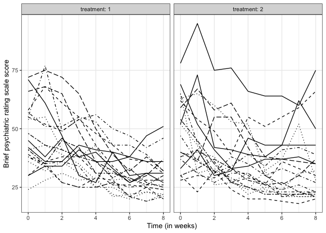
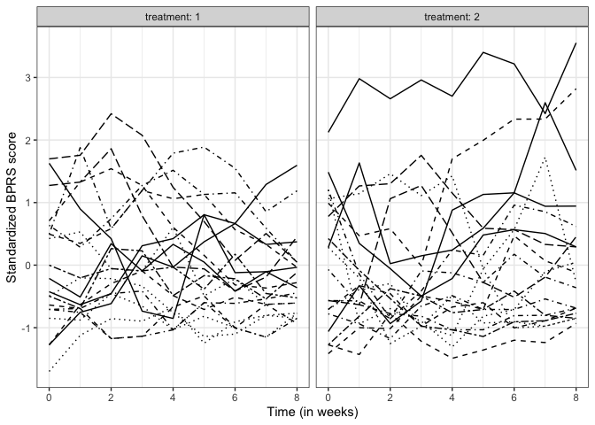
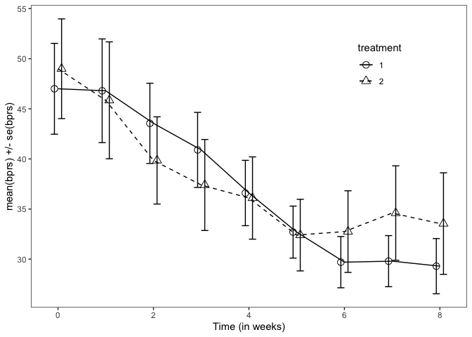
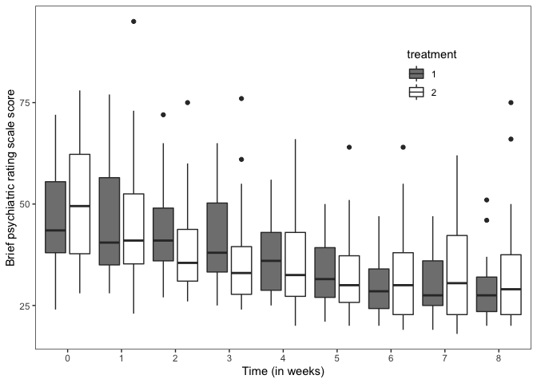
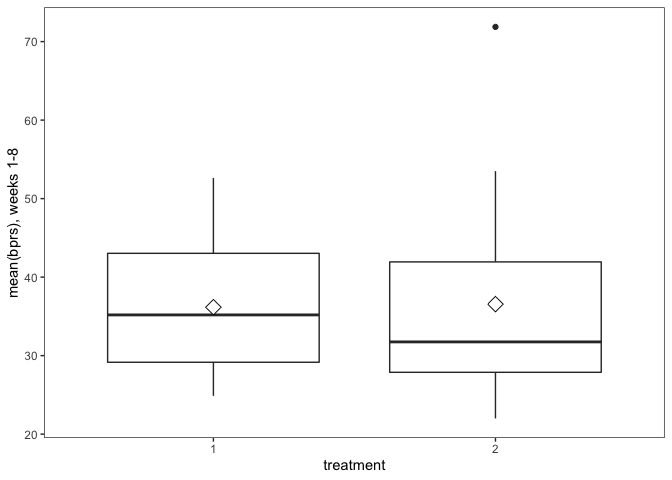
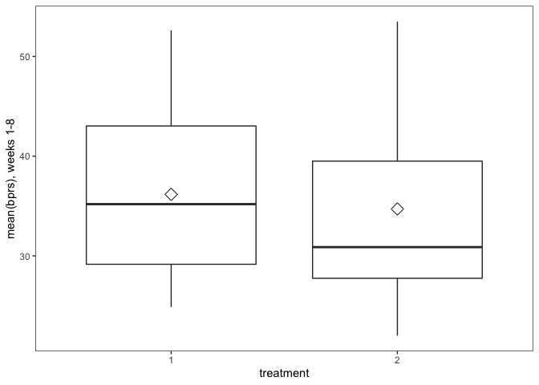

 *Multivariate Analysis for the Behavioral Sciences,*  
 **Examples of Chapter 8:**  
 **Analysis of Longitudinal Data I: Graphical Displays and Summary
Measure Approach**
================
Kimmo Vehkalahti, Brian S. Everitt; edited by C.-F. Sheu
06 September, 2019

## Example: The brief psychiatric rating scale

Here 40 male subjects were randomly assigned to one of two treatment
groups and each subject was rated on the brief psychiatric rating scale
(BPRS) measured before treatment began (week 0) and then at weekly
intervals for eight weeks. The BPRS assesses the level of 18 symptom
constructs such as hostility, suspiciousness, hallucinations and
grandiosity; each of these is rated from one (not present) to seven
(extremely severe). The scale is used to evaluate patients suspected of
having schizophrenia.

## Table 8.1: BPRS Measurements from 40 Subjects

``` r
# check to see if package management package is there
# if not install it and then
# load the data management and graphics package
if (!require(pacman)) install.packages("pacman")
pacman::p_load(tidyverse, devtools)
```

``` r
fLoc <- 'https://raw.githubusercontent.com/KimmoVehkalahti/MABS/master/Examples/data/BPRS.txt'
BPRS <- read.table(fLoc, sep = ' ', header = TRUE)
```

``` r
# convert to factors
BPRS <- within(BPRS, {
    treatment <- factor(treatment)
      subject <- factor(subject)
})
```

``` r
# have a look at the data set
glimpse(BPRS)
```

    Observations: 40
    Variables: 11
    $ treatment <fct> 1, 1, 1, 1, 1, 1, 1, 1, 1, 1, 1, 1, 1, 1, 1, 1, 1, 1, …
    $ subject   <fct> 1, 2, 3, 4, 5, 6, 7, 8, 9, 10, 11, 12, 13, 14, 15, 16,…
    $ week0     <int> 42, 58, 54, 55, 72, 48, 71, 30, 41, 57, 30, 55, 36, 38…
    $ week1     <int> 36, 68, 55, 77, 75, 43, 61, 36, 43, 51, 34, 52, 32, 35…
    $ week2     <int> 36, 61, 41, 49, 72, 41, 47, 38, 39, 51, 34, 49, 36, 36…
    $ week3     <int> 43, 55, 38, 54, 65, 38, 30, 38, 35, 55, 41, 54, 31, 34…
    $ week4     <int> 41, 43, 43, 56, 50, 36, 27, 31, 28, 53, 36, 48, 25, 25…
    $ week5     <int> 40, 34, 28, 50, 39, 29, 40, 26, 22, 43, 36, 43, 25, 27…
    $ week6     <int> 38, 28, 29, 47, 32, 33, 30, 26, 20, 43, 38, 37, 21, 25…
    $ week7     <int> 47, 28, 25, 42, 38, 27, 31, 25, 23, 39, 36, 36, 19, 26…
    $ week8     <int> 51, 28, 24, 46, 32, 25, 31, 24, 21, 32, 36, 31, 22, 26…

``` r
head(BPRS)
```

``` 
  treatment subject week0 week1 week2 week3 week4 week5 week6 week7 week8
1         1       1    42    36    36    43    41    40    38    47    51
2         1       2    58    68    61    55    43    34    28    28    28
3         1       3    54    55    41    38    43    28    29    25    24
4         1       4    55    77    49    54    56    50    47    42    46
5         1       5    72    75    72    65    50    39    32    38    32
6         1       6    48    43    41    38    36    29    33    27    25
```

``` r
tail(BPRS)
```

``` 
   treatment subject week0 week1 week2 week3 week4 week5 week6 week7 week8
35         2      15    40    36    55    55    42    30    26    30    37
36         2      16    54    45    35    27    25    22    22    22    22
37         2      17    33    41    30    32    46    43    43    43    43
38         2      18    28    30    29    33    30    26    36    33    30
39         2      19    52    43    26    27    24    32    21    21    21
40         2      20    47    36    32    29    25    23    23    23    23
```

``` r
# Convert data to long form:
BPRSL <- gather(BPRS, key = weeks, value = bprs, week0:week8) %>%
  mutate(week = as.integer(substr(weeks, 5, 5))) %>%
  arrange(subject, treatment)
```

``` r
glimpse(BPRSL)
```

    Observations: 360
    Variables: 5
    $ treatment <fct> 1, 1, 1, 1, 1, 1, 1, 1, 1, 2, 2, 2, 2, 2, 2, 2, 2, 2, …
    $ subject   <fct> 1, 1, 1, 1, 1, 1, 1, 1, 1, 1, 1, 1, 1, 1, 1, 1, 1, 1, …
    $ weeks     <chr> "week0", "week1", "week2", "week3", "week4", "week5", …
    $ bprs      <int> 42, 36, 36, 43, 41, 40, 38, 47, 51, 52, 73, 42, 41, 39…
    $ week      <int> 0, 1, 2, 3, 4, 5, 6, 7, 8, 0, 1, 2, 3, 4, 5, 6, 7, 8, …

``` r
head(BPRSL)
```

``` 
  treatment subject weeks bprs week
1         1       1 week0   42    0
2         1       1 week1   36    1
3         1       1 week2   36    2
4         1       1 week3   43    3
5         1       1 week4   41    4
6         1       1 week5   40    5
```

``` r
tail(BPRSL)
```

``` 
    treatment subject weeks bprs week
355         2      20 week3   29    3
356         2      20 week4   25    4
357         2      20 week5   23    5
358         2      20 week6   23    6
359         2      20 week7   23    7
360         2      20 week8   23    8
```

## Figure 8.1

``` r
ggplot(BPRSL, aes(x = week, y = bprs, linetype = subject)) + 
  geom_line() + 
  scale_linetype_manual(values = rep(1:10, times = 4)) +  
  facet_grid(. ~ treatment, labeller = label_both) + 
  labs(x = "Time (in weeks)", 
       y = "Brief psychiatric rating scale score") +
  theme_bw() + 
  theme(legend.position = "none") +   
  theme(panel.grid.minor.y = element_blank()) +  
  scale_y_continuous(limits = c(min(BPRSL$bprs), max(BPRSL$bprs)))
```



## Figure 8.2

``` r
# Standardise the scores:
BPRSL <- BPRSL %>%
  group_by(week) %>%
  mutate(stdbprs = scale(bprs)[,1]) %>% 
  # mutate( stdbprs = (bprs - mean(bprs))/sd(bprs) ) %>%
  ungroup()
```

``` r
glimpse(BPRSL)
```

    Observations: 360
    Variables: 6
    $ treatment <fct> 1, 1, 1, 1, 1, 1, 1, 1, 1, 2, 2, 2, 2, 2, 2, 2, 2, 2, …
    $ subject   <fct> 1, 1, 1, 1, 1, 1, 1, 1, 1, 1, 1, 1, 1, 1, 1, 1, 1, 1, …
    $ weeks     <chr> "week0", "week1", "week2", "week3", "week4", "week5", …
    $ bprs      <int> 42, 36, 36, 43, 41, 40, 38, 47, 51, 52, 73, 42, 41, 39…
    $ week      <int> 0, 1, 2, 3, 4, 5, 6, 7, 8, 0, 1, 2, 3, 4, 5, 6, 7, 8, …
    $ stdbprs   <dbl> -0.424591, -0.632190, -0.455155, 0.309186, 0.423531, 0…

``` r
ggplot(BPRSL, aes(x = week, y = stdbprs, linetype = subject)) +
  geom_line() + 
  scale_linetype_manual(values = rep(1:10, times = 4)) +
  facet_grid(. ~ treatment, labeller = label_both) + 
  labs(x = "Time (in weeks)") +
  theme_bw() + 
  theme(legend.position = "none") +
  theme(panel.grid.minor.y = element_blank()) +
  scale_y_continuous(name = "Standardized BPRS score")
```



## Figure 8.3

``` r
# Number of weeks, baseline (week 0) included:
n <- BPRSL$week %>% 
  unique() %>% 
  length()
```

``` r
# Make a summary data:
BPRSS <- BPRSL %>%
  group_by(treatment, week) %>%
  summarize(mean = mean(bprs), se = sd(bprs)/sqrt(n) ) %>%
  ungroup()
```

``` r
glimpse(BPRSS)
```

    Observations: 18
    Variables: 4
    $ treatment <fct> 1, 1, 1, 1, 1, 1, 1, 1, 1, 2, 2, 2, 2, 2, 2, 2, 2, 2
    $ week      <int> 0, 1, 2, 3, 4, 5, 6, 7, 8, 0, 1, 2, 3, 4, 5, 6, 7, 8
    $ mean      <dbl> 47.00, 46.80, 43.55, 40.90, 36.60, 32.70, 29.70, 29.80…
    $ se        <dbl> 4.5345, 5.1737, 4.0036, 3.7446, 3.2595, 2.5958, 2.5572…

``` r
ggplot(BPRSS, aes(x = week, y = mean, linetype = treatment, shape = treatment)) + 
  geom_line() + 
  scale_linetype_manual(values = c(1, 2)) +
  geom_point(size = 3, position = position_dodge(width = 0.3)) + 
  scale_shape_manual(values = c(1,2)) +
  geom_errorbar(aes(ymin = mean-se, ymax = mean+se, linetype = "1"),
                width = 0.3, position = position_dodge(width = 0.3)) + 
  labs(x = "Time (in weeks)") +
  theme_bw() + 
  theme(panel.grid.major = element_blank(), 
        panel.grid.minor = element_blank()) + 
  theme(legend.position = c(0.8, 0.8)) + 
  scale_y_continuous(name = "mean(bprs) +/- se(bprs)")
```



## Figure 8.4

``` r
ggplot(BPRSL, aes(x = factor(week), y = bprs, fill = treatment)) +
  geom_boxplot(position = position_dodge(width = 0.9)) + 
  theme_bw() + 
  labs(y = "Brief psychiatric rating scale score") +
  theme(panel.grid.major = element_blank(), 
        panel.grid.minor = element_blank()) + 
  theme(legend.position = c(0.8, 0.8)) +
  scale_x_discrete(name = "Time (in weeks)") + 
  scale_fill_grey(start = 0.5, end = 1)
```



## Figure 8.5

``` r
# Make a summary data of the post treatment weeks (1-8)
BPRSL8S <- BPRSL %>%
  filter(week > 0) %>%
  group_by(treatment, subject) %>%
  summarise(mean = mean(bprs) ) %>%
  ungroup()
```

``` r
glimpse(BPRSL8S)
```

    Observations: 40
    Variables: 3
    $ treatment <fct> 1, 1, 1, 1, 1, 1, 1, 1, 1, 1, 1, 1, 1, 1, 1, 1, 1, 1, …
    $ subject   <fct> 1, 2, 3, 4, 5, 6, 7, 8, 9, 10, 11, 12, 13, 14, 15, 16,…
    $ mean      <dbl> 41.500, 43.125, 35.375, 52.625, 50.375, 34.000, 37.125…

``` r
ggplot(BPRSL8S, aes(x = treatment, y = mean)) + 
  geom_boxplot() + 
  theme_bw() + 
  theme(panel.grid.major = element_blank(), 
        panel.grid.minor = element_blank()) + 
  stat_summary(fun.y = "mean", geom = "point", 
               shape = 23, size = 4, fill = "white") +
  scale_y_continuous(name = "mean(bprs), weeks 1-8")
```



## Figure 8.6

``` r
# Remove the outlier:
BPRSL8S1 <- BPRSL8S %>%
  filter(mean < 60)
```

``` r
glimpse(BPRSL8S1)
```

    Observations: 39
    Variables: 3
    $ treatment <fct> 1, 1, 1, 1, 1, 1, 1, 1, 1, 1, 1, 1, 1, 1, 1, 1, 1, 1, …
    $ subject   <fct> 1, 2, 3, 4, 5, 6, 7, 8, 9, 10, 11, 12, 13, 14, 15, 16,…
    $ mean      <dbl> 41.500, 43.125, 35.375, 52.625, 50.375, 34.000, 37.125…

``` r
ggplot(BPRSL8S1, aes(x = treatment, y = mean)) + 
  geom_boxplot() + 
  theme_bw() + 
  theme(panel.grid.major = element_blank(), 
        panel.grid.minor = element_blank()) + 
  stat_summary(fun.y = "mean", geom = "point", 
               shape = 23, size = 4, fill = "white") + 
  scale_y_continuous(name = "mean(bprs), weeks 1-8")
```



## Table 8.3

``` r
# Without the outlier, apply Student's t-test, two-sided:
t.test(mean ~ treatment, data = BPRSL8S1, var.equal = TRUE)
```

``` 

    Two Sample t-test

data:  mean by treatment
t = 0.521, df = 37, p-value = 0.61
alternative hypothesis: true difference in means is not equal to 0
95 percent confidence interval:
 -4.2325  7.1621
sample estimates:
mean in group 1 mean in group 2 
         36.169          34.704 
```

## Table 8.4

``` r
# Add the baseline from the original data as a new variable to the summary data:
baseline <- BPRS$week0
BPRSL8S2 <- BPRSL8S %>%
  mutate(baseline)
```

``` r
# Fit the ANCOVA model and see the results:
fit <- lm(mean ~ baseline + treatment, data = BPRSL8S2)
summary(fit)
```

``` 

Call:
lm(formula = mean ~ baseline + treatment, data = BPRSL8S2)

Residuals:
    Min      1Q  Median      3Q     Max 
-16.173  -4.599   0.109   4.670  21.066 

Coefficients:
            Estimate Std. Error t value Pr(>|t|)
(Intercept)  13.0790     4.5571    2.87   0.0067
baseline      0.4913     0.0894    5.49  3.1e-06
treatment2   -0.5888     2.4958   -0.24   0.8148

Residual standard error: 7.87 on 37 degrees of freedom
Multiple R-squared:  0.449, Adjusted R-squared:  0.42 
F-statistic: 15.1 on 2 and 37 DF,  p-value: 1.61e-05
```

``` r
anova(fit)
```

``` 
Analysis of Variance Table

Response: mean
          Df Sum Sq Mean Sq F value  Pr(>F)
baseline   1   1868    1868   30.14 3.1e-06
treatment  1      3       3    0.06    0.81
Residuals 37   2293      62                
```

## Session information
