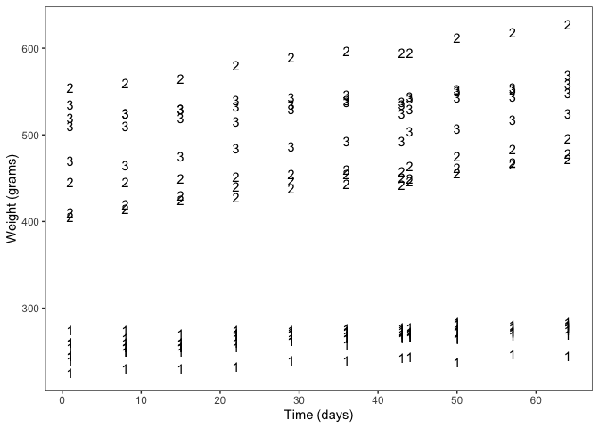
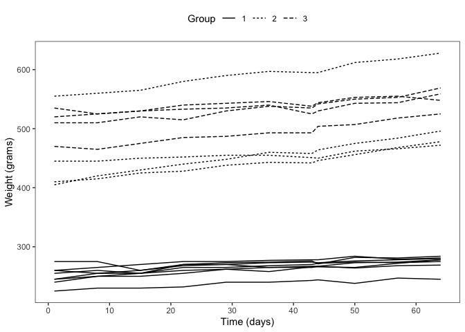
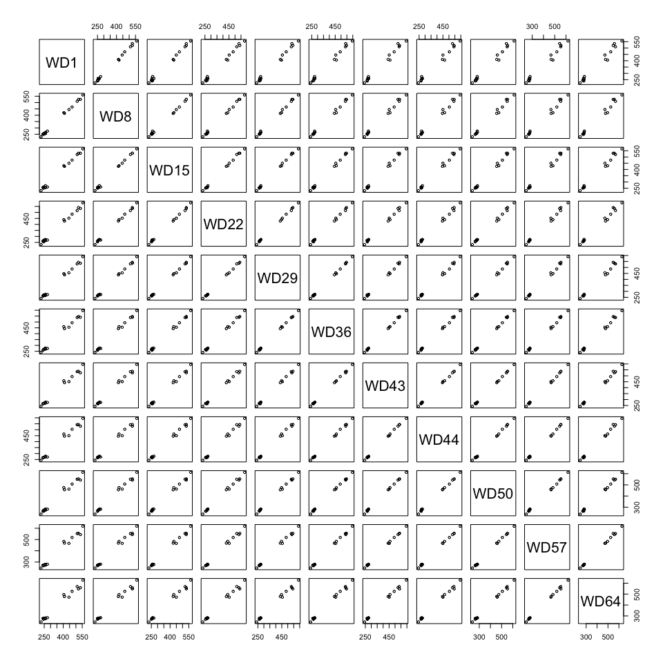
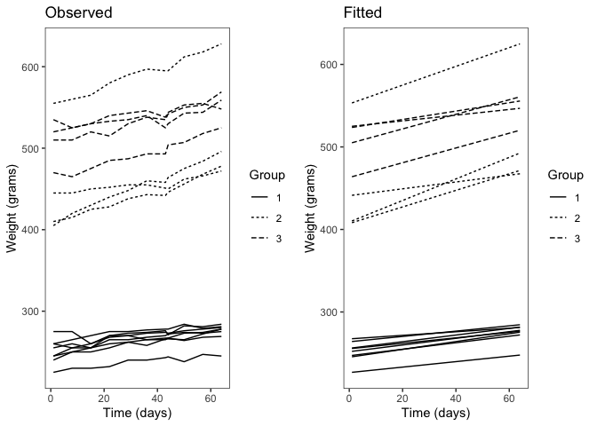

 *Multivariate Analysis for the Behavioral Sciences,*  
 **Examples of Chapter 9:**  
 **Analysis of Longitudinal Data II: Linear Mixed Effects Models for
Normal Response Variables**
================
“Kimmo Vehkalahti, Brian S. Everitt; edited by C.-F. Sheu”
07 September, 2019

## Example: Rat weight over time for different diets

Data from a nutrition study conducted in three groups of rats The three
groups were put on different diets, and each animal’s body weight
(grams) was recorded repeatedly (approximately weekly, except in week
seven when two recordings were taken) over a 9-week period. The question
of most interest is whether the growth profiles of the three groups
differ.

``` r
# check to see if the pacman package is there
# if not install it and then use it manage packages
if (!require(pacman)) install.packages("pacman")
pacman::p_load(tidyverse, nlme, lme4, gridExtra)
```

## Table 9.1: Body Weights of Rats

``` r
# file location
fLoc <- "https://raw.githubusercontent.com/KimmoVehkalahti/MABS/master/Examples/data/rats.txt"
```

``` r
# data input
RATS <- read.table(fLoc, header = TRUE, sep = '\t')
```

``` r
RATS <- within(RATS, {
  ID <- factor(ID)
  Group <- factor(Group)})
```

``` r
glimpse(RATS)
```

    Observations: 16
    Variables: 13
    $ ID    <fct> 1, 2, 3, 4, 5, 6, 7, 8, 9, 10, 11, 12, 13, 14, 15, 16
    $ Group <fct> 1, 1, 1, 1, 1, 1, 1, 1, 2, 2, 2, 2, 3, 3, 3, 3
    $ WD1   <int> 240, 225, 245, 260, 255, 260, 275, 245, 410, 405, 445, 555…
    $ WD8   <int> 250, 230, 250, 255, 260, 265, 275, 255, 415, 420, 445, 560…
    $ WD15  <int> 255, 230, 250, 255, 255, 270, 260, 260, 425, 430, 450, 565…
    $ WD22  <int> 260, 232, 255, 265, 270, 275, 270, 268, 428, 440, 452, 580…
    $ WD29  <int> 262, 240, 262, 265, 270, 275, 273, 270, 438, 448, 455, 590…
    $ WD36  <int> 258, 240, 265, 268, 273, 277, 274, 265, 443, 460, 455, 597…
    $ WD43  <int> 266, 243, 267, 270, 274, 278, 276, 265, 442, 458, 451, 595…
    $ WD44  <int> 266, 244, 267, 272, 273, 278, 271, 267, 446, 464, 450, 595…
    $ WD50  <int> 265, 238, 264, 274, 276, 284, 282, 273, 456, 475, 462, 612…
    $ WD57  <int> 272, 247, 268, 273, 278, 279, 281, 274, 468, 484, 466, 618…
    $ WD64  <int> 278, 245, 269, 275, 280, 281, 284, 278, 478, 496, 472, 628…

The data set in also available from the *nlme* package as a grouped data
frame object called *BodyWeight*.

``` r
knitr::kable(head(nlme::BodyWeight, 15))
```

| weight | Time | Rat | Diet |
| -----: | ---: | :-- | :--- |
|    240 |    1 | 1   | 1    |
|    250 |    8 | 1   | 1    |
|    255 |   15 | 1   | 1    |
|    260 |   22 | 1   | 1    |
|    262 |   29 | 1   | 1    |
|    258 |   36 | 1   | 1    |
|    266 |   43 | 1   | 1    |
|    266 |   44 | 1   | 1    |
|    265 |   50 | 1   | 1    |
|    272 |   57 | 1   | 1    |
|    278 |   64 | 1   | 1    |
|    225 |    1 | 2   | 1    |
|    230 |    8 | 2   | 1    |
|    230 |   15 | 2   | 1    |
|    232 |   22 | 2   | 1    |

``` r
RATSL <- nlme::BodyWeight
```

``` r
names(RATSL) <- c("Weight", "Time", "ID", "Group")
```

``` r
glimpse(RATSL)
```

    Observations: 176
    Variables: 4
    $ Weight <dbl> 240, 250, 255, 260, 262, 258, 266, 266, 265, 272, 278, 22…
    $ Time   <dbl> 1, 8, 15, 22, 29, 36, 43, 44, 50, 57, 64, 1, 8, 15, 22, 2…
    $ ID     <ord> 1, 1, 1, 1, 1, 1, 1, 1, 1, 1, 1, 2, 2, 2, 2, 2, 2, 2, 2, …
    $ Group  <fct> 1, 1, 1, 1, 1, 1, 1, 1, 1, 1, 1, 1, 1, 1, 1, 1, 1, 1, 1, …

## Figure 9.1

``` r
# set black and white theme
ot <- theme_set(theme_bw())
```

``` r
ggplot(data = RATSL, aes(x = Time, y = Weight, group = ID)) +
  geom_text(aes(label = Group)) + 
  scale_x_continuous(name = "Time (days)", breaks = seq(0, 60, 10)) +
  scale_y_continuous(name = "Weight (grams)") + 
  theme(panel.grid.major = element_blank(), 
        panel.grid.minor = element_blank())
```



## Table 9.3

``` r
RATS_reg <- lm(Weight ~ Time + Group, data = RATSL)
summary(RATS_reg)
```

``` 

Call:
lm(formula = Weight ~ Time + Group, data = RATSL)

Residuals:
   Min     1Q Median     3Q    Max 
 -60.6  -24.0    0.7   10.8  125.5 

Coefficients:
            Estimate Std. Error t value Pr(>|t|)
(Intercept)  244.069      5.773    42.3  < 2e-16
Time           0.586      0.133     4.4  1.9e-05
Group2       220.989      6.340    34.9  < 2e-16
Group3       262.080      6.340    41.3  < 2e-16

Residual standard error: 34.3 on 172 degrees of freedom
Multiple R-squared:  0.928, Adjusted R-squared:  0.927 
F-statistic:  743 on 3 and 172 DF,  p-value: <2e-16
```

``` r
# dummies (in Table) vs summary output: D1 = Group2, D2 = Group3
```

## Figure 9.2

``` r
ggplot(RATSL, aes(x = Time, y = Weight, group = ID)) +
  geom_line(aes(linetype = Group)) + 
  scale_x_continuous(name = "Time (days)", breaks = seq(0, 60, 10)) +
  scale_y_continuous(name = "Weight (grams)") + 
  theme(legend.position = "top") + 
  theme(panel.grid.major = element_blank(), 
        panel.grid.minor = element_blank())
```



## Figure 9.3

``` r
pairs(RATS[, 3:13], cex = 0.7)
```



## Table 9.4

``` r
RATS_ref <- lme4::lmer(Weight ~ Time + Group + (1 | ID), 
                       data = RATSL, REML = FALSE)
summary(RATS_ref)
```

    Linear mixed model fit by maximum likelihood  ['lmerMod']
    Formula: Weight ~ Time + Group + (1 | ID)
       Data: RATSL
    
         AIC      BIC   logLik deviance df.resid 
      1333.2   1352.2   -660.6   1321.2      170 
    
    Scaled residuals: 
       Min     1Q Median     3Q    Max 
    -3.539 -0.558 -0.049  0.569  3.099 
    
    Random effects:
     Groups   Name        Variance Std.Dev.
     ID       (Intercept) 1085.9   32.95   
     Residual               66.4    8.15   
    Number of obs: 176, groups:  ID, 16
    
    Fixed effects:
                Estimate Std. Error t value
    (Intercept) 244.0689    11.7311    20.8
    Time          0.5857     0.0316    18.5
    Group2      220.9886    20.2358    10.9
    Group3      262.0795    20.2358    12.9
    
    Correlation of Fixed Effects:
           (Intr) Time   Group2
    Time   -0.090              
    Group2 -0.575  0.000       
    Group3 -0.575  0.000  0.333

``` r
# dummies (in Table) vs summary output: D1 = Group2, D2 = Group3
```

## Table 9.5

``` r
RATS_ref1 <- lme4::lmer(Weight ~ Time + Group + (Time | ID), 
                        data = RATSL, REML = FALSE)
summary(RATS_ref1)
```

    Linear mixed model fit by maximum likelihood  ['lmerMod']
    Formula: Weight ~ Time + Group + (Time | ID)
       Data: RATSL
    
         AIC      BIC   logLik deviance df.resid 
      1194.2   1219.6   -589.1   1178.2      168 
    
    Scaled residuals: 
       Min     1Q Median     3Q    Max 
    -3.226 -0.432  0.055  0.564  2.883 
    
    Random effects:
     Groups   Name        Variance Std.Dev. Corr 
     ID       (Intercept) 1140.765 33.775        
              Time           0.112  0.335   -0.22
     Residual               19.745  4.444        
    Number of obs: 176, groups:  ID, 16
    
    Fixed effects:
                Estimate Std. Error t value
    (Intercept) 246.4555    11.8164   20.86
    Time          0.5857     0.0855    6.85
    Group2      214.5922    20.1816   10.63
    Group3      258.9297    20.1816   12.83
    
    Correlation of Fixed Effects:
           (Intr) Time   Group2
    Time   -0.166              
    Group2 -0.569  0.000       
    Group3 -0.569  0.000  0.333

``` r
# dummies (in Table) vs summary output: D1 = Group2, D2 = Group3
```

``` r
anova(RATS_ref1, RATS_ref)
```

    Data: RATSL
    Models:
    RATS_ref: Weight ~ Time + Group + (1 | ID)
    RATS_ref1: Weight ~ Time + Group + (Time | ID)
              Df  AIC  BIC logLik deviance Chisq Chi Df Pr(>Chisq)
    RATS_ref   6 1333 1352   -661     1321                        
    RATS_ref1  8 1194 1220   -589     1178   143      2     <2e-16

## Table 9.6

``` r
RATS_ref2 <- lme4::lmer(Weight ~ Time * Group + (Time | ID), 
                        data = RATSL, REML = FALSE)
```

    Warning in checkConv(attr(opt, "derivs"), opt$par, ctrl =
    control$checkConv, : Model failed to converge with max|grad| = 0.0269555
    (tol = 0.002, component 1)

``` r
summary(RATS_ref2)
```

    Linear mixed model fit by maximum likelihood  ['lmerMod']
    Formula: Weight ~ Time * Group + (Time | ID)
       Data: RATSL
    
         AIC      BIC   logLik deviance df.resid 
      1185.9   1217.6   -582.9   1165.9      166 
    
    Scaled residuals: 
       Min     1Q Median     3Q    Max 
    -3.266 -0.425  0.073  0.603  2.750 
    
    Random effects:
     Groups   Name        Variance Std.Dev. Corr 
     ID       (Intercept) 1.10e+03 33.171        
              Time        4.92e-02  0.222   -0.15
     Residual             1.98e+01  4.445        
    Number of obs: 176, groups:  ID, 16
    
    Fixed effects:
                Estimate Std. Error t value
    (Intercept) 251.6517    11.7656   21.39
    Time          0.3596     0.0821    4.38
    Group2      200.6655    20.3787    9.85
    Group3      252.0717    20.3787   12.37
    Time:Group2   0.6058     0.1422    4.26
    Time:Group3   0.2983     0.1422    2.10
    
    Correlation of Fixed Effects:
                (Intr) Time   Group2 Group3 Tm:Gr2
    Time        -0.159                            
    Group2      -0.577  0.092                     
    Group3      -0.577  0.092  0.333              
    Time:Group2  0.092 -0.577 -0.159 -0.053       
    Time:Group3  0.092 -0.577 -0.053 -0.159  0.333
    convergence code: 0
    Model failed to converge with max|grad| = 0.0269555 (tol = 0.002, component 1)

``` r
# dummies (in Table) vs summary output: D1 = Group2, D2 = Group3
```

``` r
anova(RATS_ref1, RATS_ref2)
```

    Data: RATSL
    Models:
    RATS_ref1: Weight ~ Time + Group + (Time | ID)
    RATS_ref2: Weight ~ Time * Group + (Time | ID)
              Df  AIC  BIC logLik deviance Chisq Chi Df Pr(>Chisq)
    RATS_ref1  8 1194 1220   -589     1178                        
    RATS_ref2 10 1186 1218   -583     1166  12.4      2     0.0021

## Figure 9.4

``` r
# add fitted values to he original data frame 
RATSL <- data.frame(RATSL, Fitted = fitted(RATS_ref2))
```

``` r
# observed
g1 <- ggplot(RATSL, aes(x = Time, y = Weight, group = ID)) +
  geom_line(aes(linetype = Group)) + 
  scale_x_continuous(name = "Time (days)", breaks = seq(0, 60, 20)) +
  scale_y_continuous(name = "Weight (grams)") + 
  # "none" in the book
  theme(legend.position = "right") + 
  theme(panel.grid.major = element_blank(), 
        panel.grid.minor = element_blank()) +
  ggtitle("Observed")
# fitted
g2 <- ggplot(RATSL, aes(x = Time, y = Fitted, group = ID)) +
  geom_line(aes(linetype = Group)) + 
  scale_x_continuous(name = "Time (days)", breaks = seq(0, 60, 20)) +
  scale_y_continuous(name = "Weight (grams)") + 
  theme(legend.position = "right") + 
  theme(panel.grid.major = element_blank(), 
        panel.grid.minor = element_blank()) + 
  ggtitle("Fitted")
# side by side
grid.arrange(g1, g2, nrow = 1)
```



## Session information
