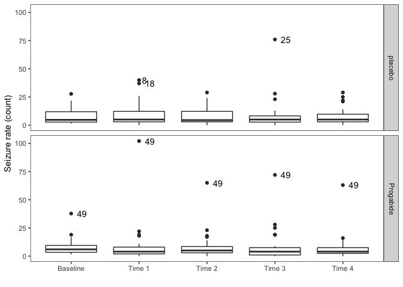

*Multivariate Analysis for the Behavioral Sciences,*  
**Examples of Chapter 10:**  
**Analysis of Longitudinal Data III: Non-Normal Responses**
================
Kimmo Vehkalahti, Brian S. Everitt; edited by C.-F. Sheu
08 September, 2019

``` r
# check to see if the pacman package is there
# if not install it and then use it manage packages
if (!require(pacman)) install.packages("pacman")
pacman::p_load(tidyverse, gee, lme4, HSAUR3)
```

## Example: Epilepsy

A randomised clinical trial was conduted to investigate the effect of an
anti-epileptic drug. In the study, 59 patients suffering from epilepsy
were randomized to groups receiving either the anti-epileptic drug
Progabide or a placebo in addition to standard chemotherapy. The numbers
of seizures suffered in each of four, two-week periods were recorded for
each patient along with a baseline seizure count for the 8 weeks prior
to being randomized to treatment and age. The number of epileptic
seizures before and after treatment separately for the two treatment
groups (the before count is the two-week average).

The main question of interest is whether taking progabide reduced the
number of epileptic seizures compared with
placebo.

## Table 10.2: Data from a Clinical Trial of Patients Suffering from Epilepsy

Data are in long form.

``` r
data(epilepsy, package = "HSAUR3")
```

``` r
# make a copy
EPIL <- HSAUR3::epilepsy 
```

``` r
glimpse(EPIL); head(EPIL)
```

    Observations: 236
    Variables: 6
    $ treatment    <fct> placebo, placebo, placebo, placebo, placebo, placeb…
    $ base         <int> 11, 11, 11, 11, 11, 11, 11, 11, 6, 6, 6, 6, 8, 8, 8…
    $ age          <int> 31, 31, 31, 31, 30, 30, 30, 30, 25, 25, 25, 25, 36,…
    $ seizure.rate <int> 5, 3, 3, 3, 3, 5, 3, 3, 2, 4, 0, 5, 4, 4, 1, 4, 7, …
    $ period       <ord> 1, 2, 3, 4, 1, 2, 3, 4, 1, 2, 3, 4, 1, 2, 3, 4, 1, …
    $ subject      <fct> 1, 1, 1, 1, 2, 2, 2, 2, 3, 3, 3, 3, 4, 4, 4, 4, 5, …

``` 
    treatment base age seizure.rate period subject
1     placebo   11  31            5      1       1
110   placebo   11  31            3      2       1
112   placebo   11  31            3      3       1
114   placebo   11  31            3      4       1
2     placebo   11  30            3      1       2
210   placebo   11  30            5      2       2
```

``` r
# convert data to WIDE form:
# (sep: set valid names month0:month4 here! otherwise just 0:4)
EPI <- EPIL %>% 
  spread(key = period, value = seizure.rate, sep = "") %>% 
  arrange(subject)
```

``` r
glimpse(EPI); head(EPI)
```

    Observations: 59
    Variables: 8
    $ treatment <fct> placebo, placebo, placebo, placebo, placebo, placebo, …
    $ base      <int> 11, 11, 6, 8, 66, 27, 12, 52, 23, 10, 52, 33, 18, 42, …
    $ age       <int> 31, 30, 25, 36, 22, 29, 31, 42, 37, 28, 36, 24, 23, 36…
    $ subject   <fct> 1, 2, 3, 4, 5, 6, 7, 8, 9, 10, 11, 12, 13, 14, 15, 16,…
    $ period1   <int> 5, 3, 2, 4, 7, 5, 6, 40, 5, 14, 26, 12, 4, 7, 16, 11, …
    $ period2   <int> 3, 5, 4, 4, 18, 2, 4, 20, 6, 13, 12, 6, 4, 9, 24, 0, 0…
    $ period3   <int> 3, 3, 0, 1, 9, 8, 0, 23, 6, 6, 6, 8, 6, 12, 10, 0, 3, …
    $ period4   <int> 3, 3, 5, 4, 21, 7, 2, 12, 5, 0, 22, 4, 2, 14, 9, 5, 3,…

``` 
  treatment base age subject period1 period2 period3 period4
1   placebo   11  31       1       5       3       3       3
2   placebo   11  30       2       3       5       3       3
3   placebo    6  25       3       2       4       0       5
4   placebo    8  36       4       4       4       1       4
5   placebo   66  22       5       7      18       9      21
6   placebo   27  29       6       5       2       8       7
```

``` r
#correct the baseline when converting to long form:
EPIL <- gather(EPI, key = periods, value = seizure.rate, period1:period4) %>%
  mutate( base2 = base/4, week = as.integer(substr(periods, 7, 7)) ) %>% 
  arrange(subject)
```

``` r
glimpse(EPIL); head(EPIL)
```

    Observations: 236
    Variables: 8
    $ treatment    <fct> placebo, placebo, placebo, placebo, placebo, placeb…
    $ base         <int> 11, 11, 11, 11, 11, 11, 11, 11, 6, 6, 6, 6, 8, 8, 8…
    $ age          <int> 31, 31, 31, 31, 30, 30, 30, 30, 25, 25, 25, 25, 36,…
    $ subject      <fct> 1, 1, 1, 1, 2, 2, 2, 2, 3, 3, 3, 3, 4, 4, 4, 4, 5, …
    $ periods      <chr> "period1", "period2", "period3", "period4", "period…
    $ seizure.rate <int> 5, 3, 3, 3, 3, 5, 3, 3, 2, 4, 0, 5, 4, 4, 1, 4, 7, …
    $ base2        <dbl> 2.75, 2.75, 2.75, 2.75, 2.75, 2.75, 2.75, 2.75, 1.5…
    $ week         <int> 1, 2, 3, 4, 1, 2, 3, 4, 1, 2, 3, 4, 1, 2, 3, 4, 1, …

``` 
  treatment base age subject periods seizure.rate base2 week
1   placebo   11  31       1 period1            5  2.75    1
2   placebo   11  31       1 period2            3  2.75    2
3   placebo   11  31       1 period3            3  2.75    3
4   placebo   11  31       1 period4            3  2.75    4
5   placebo   11  30       2 period1            3  2.75    1
6   placebo   11  30       2 period2            5  2.75    2
```

## Figure 10.3

``` r
# Convert data to long form, including the baseline;
# correct the baseline first:
EPIL0 <- EPI %>% 
  mutate(base2 = base/4) %>%
  gather(., key = periods, value = seizure.rate, base2, period1:period4) %>% 
  arrange(subject)
```

``` r
glimpse(EPIL0); head(EPIL0)
```

    Observations: 295
    Variables: 6
    $ treatment    <fct> placebo, placebo, placebo, placebo, placebo, placeb…
    $ base         <int> 11, 11, 11, 11, 11, 11, 11, 11, 11, 11, 6, 6, 6, 6,…
    $ age          <int> 31, 31, 31, 31, 31, 30, 30, 30, 30, 30, 25, 25, 25,…
    $ subject      <fct> 1, 1, 1, 1, 1, 2, 2, 2, 2, 2, 3, 3, 3, 3, 3, 4, 4, …
    $ periods      <chr> "base2", "period1", "period2", "period3", "period4"…
    $ seizure.rate <dbl> 2.75, 5.00, 3.00, 3.00, 3.00, 2.75, 3.00, 5.00, 3.0…

``` 
  treatment base age subject periods seizure.rate
1   placebo   11  31       1   base2         2.75
2   placebo   11  31       1 period1         5.00
3   placebo   11  31       1 period2         3.00
4   placebo   11  31       1 period3         3.00
5   placebo   11  31       1 period4         3.00
6   placebo   11  30       2   base2         2.75
```

[Mark some of the
outliers:](https://stackoverflow.com/questions/33524669/labeling-outliers-of-boxplots-in-r)

``` r
# changed the upper coeff from 1.5 to 3.5 (only more extreme observations highlighted)
is_outlier <- function(x) {
  return(x < quantile(x, 0.25) - 1.5 * IQR(x) | x > quantile(x, 0.75) + 3.5 * IQR(x))
}
```

``` r
# use subject id (not seizure.rate itself!) for identification:
EPIL0 <- EPIL0 %>%
  mutate(outlier = ifelse(is_outlier(seizure.rate), subject, as.numeric(NA)))
```

``` r
ggplot(EPIL0, aes(x = factor(periods), y = seizure.rate, fill = treatment)) + 
  geom_boxplot() + 
  geom_text(aes(label = outlier), na.rm = TRUE, hjust = -0.6) +
  facet_grid(treatment ~ ., labeller = label_parsed) + 
  theme_bw() + 
  theme(panel.grid.major = element_blank(), 
        panel.grid.minor = element_blank()) +
  theme(legend.position = "none") + 
  scale_x_discrete(name = "", 
                   labels = c("Baseline", "Time 1", "Time 2", "Time 3", "Time 4")) + 
  scale_y_continuous(name = "Seizure rate (count)") +
  scale_fill_grey(start = 1, end = 1) 
```



## Table 10.8

``` r
t1 <- as.data.frame(tapply(EPIL0$seizure.rate, EPIL0$period, mean))
t2 <- as.data.frame(tapply(EPIL0$seizure.rate, EPIL0$period, var))
tab108 <- cbind(t1, t2)
names(tab108) = c("mean", "variance")
tab108
```

``` 
          mean variance
base2   7.8051   45.149
period1 8.9492  220.084
period2 8.3559  103.785
period3 8.4407  200.182
period4 7.3051   93.112
```

## Table 10.9

``` r
xnam <- c(names(EPIL)[c(1,3,8)], "log(base2)")
(fmla5 <- as.formula(paste("seizure.rate ~ ", paste(xnam, collapse= "+"))))
```

    seizure.rate ~ treatment + age + week + log(base2)

``` r
epil_gee1 <- gee(fmla5, data = EPIL, 
                 family = "poisson", id = subject, 
                 corstr = "exchangeable", scale.fix = FALSE)
```

``` 
       (Intercept) treatmentProgabide                age 
         -0.844060          -0.030054           0.019320 
              week         log(base2) 
         -0.058724           1.220826 
```

``` r
summary(epil_gee1)
```

``` 

 GEE:  GENERALIZED LINEAR MODELS FOR DEPENDENT DATA
 gee S-function, version 4.13 modified 98/01/27 (1998) 

Model:
 Link:                      Logarithm 
 Variance to Mean Relation: Poisson 
 Correlation Structure:     Exchangeable 

Call:
gee(formula = fmla5, id = subject, data = EPIL, family = "poisson", 
    corstr = "exchangeable", scale.fix = FALSE)

Summary of Residuals:
      Min        1Q    Median        3Q       Max 
-15.53460  -3.24216  -0.35942   1.47686  60.22536 


Coefficients:
                    Estimate Naive S.E.  Naive z Robust S.E. Robust z
(Intercept)        -0.875301   0.529465 -1.65318   0.4733656  -1.8491
treatmentProgabide -0.024212   0.155327 -0.15587   0.1910879  -0.1267
age                 0.019996   0.012505  1.59913   0.0097927   2.0420
week               -0.058723   0.034591 -1.69764   0.0349976  -1.6779
log(base2)          1.224699   0.105547 11.60337   0.1556737   7.8671

Estimated Scale Parameter:  4.8222
Number of Iterations:  2

Working Correlation
        [,1]    [,2]    [,3]    [,4]
[1,] 1.00000 0.39864 0.39864 0.39864
[2,] 0.39864 1.00000 0.39864 0.39864
[3,] 0.39864 0.39864 1.00000 0.39864
[4,] 0.39864 0.39864 0.39864 1.00000
```

## Table 10.11

``` r
# set up the model formula for lme4
(fmla6 <- as.formula(paste("seizure.rate ~ ", 
                           paste0(paste(xnam, collapse = "+"), 
                                  " + (1 | subject)"))))
```

    seizure.rate ~ treatment + age + week + log(base2) + (1 | subject)

``` r
epil_glmm <- lme4::glmer(fmla6, data = EPIL, family = "poisson")
```

    Warning in checkConv(attr(opt, "derivs"), opt$par, ctrl =
    control$checkConv, : Model failed to converge with max|grad| = 0.00241627
    (tol = 0.001, component 1)

``` r
summary(epil_glmm)
```

    Generalized linear mixed model fit by maximum likelihood (Laplace
      Approximation) [glmerMod]
     Family: poisson  ( log )
    Formula: 
    seizure.rate ~ treatment + age + week + log(base2) + (1 | subject)
       Data: EPIL
    
         AIC      BIC   logLik deviance df.resid 
      1346.2   1367.0   -667.1   1334.2      230 
    
    Scaled residuals: 
       Min     1Q Median     3Q    Max 
    -3.298 -0.876 -0.089  0.604  7.242 
    
    Random effects:
     Groups  Name        Variance Std.Dev.
     subject (Intercept) 0.268    0.518   
    Number of obs: 236, groups:  subject, 59
    
    Fixed effects:
                       Estimate Std. Error z value Pr(>|z|)
    (Intercept)         -0.1753     0.4387   -0.40   0.6894
    treatmentProgabide  -0.3200     0.1506   -2.12   0.0336
    age                  0.0107     0.0122    0.88   0.3780
    week                -0.0587     0.0202   -2.91   0.0036
    log(base2)           1.0253     0.1012   10.14   <2e-16
    
    Correlation of Fixed Effects:
                (Intr) trtmnP age    week  
    trtmntPrgbd -0.243                     
    age         -0.872  0.110              
    week        -0.112  0.000  0.000       
    log(base2)  -0.545 -0.043  0.161  0.000
    convergence code: 0
    Model failed to converge with max|grad| = 0.00241627 (tol = 0.001, component 1)

## Table 10.12

``` r
# set up the model formula for lme4
(fmla7 <- as.formula(paste("seizure.rate ~ ", 
                           paste0(paste(xnam, collapse = "+"), 
                                  " + (1 + week | subject)"))))
```

    seizure.rate ~ treatment + age + week + log(base2) + (1 + week | 
        subject)

``` r
epil_glmm2 <- lme4::glmer(fmla7, data = EPIL, family = "poisson")
```

    Warning in checkConv(attr(opt, "derivs"), opt$par, ctrl =
    control$checkConv, : Model failed to converge with max|grad| = 0.00339469
    (tol = 0.001, component 1)

``` r
summary(epil_glmm2)
```

    Generalized linear mixed model fit by maximum likelihood (Laplace
      Approximation) [glmerMod]
     Family: poisson  ( log )
    Formula: seizure.rate ~ treatment + age + week + log(base2) + (1 + week |  
        subject)
       Data: EPIL
    
         AIC      BIC   logLik deviance df.resid 
      1330.4   1358.1   -657.2   1314.4      228 
    
    Scaled residuals: 
       Min     1Q Median     3Q    Max 
    -2.984 -0.781 -0.100  0.539  6.378 
    
    Random effects:
     Groups  Name        Variance Std.Dev. Corr 
     subject (Intercept) 0.4134   0.643         
             week        0.0213   0.146    -0.60
    Number of obs: 236, groups:  subject, 59
    
    Fixed effects:
                       Estimate Std. Error z value Pr(>|z|)
    (Intercept)         -0.1877     0.4435   -0.42    0.672
    treatmentProgabide  -0.3167     0.1502   -2.11    0.035
    age                  0.0100     0.0123    0.81    0.417
    week                -0.0514     0.0326   -1.57    0.116
    log(base2)           1.0252     0.1009   10.17   <2e-16
    
    Correlation of Fixed Effects:
                (Intr) trtmnP age    week  
    trtmntPrgbd -0.243                     
    age         -0.864  0.113              
    week        -0.136 -0.004 -0.051       
    log(base2)  -0.537 -0.042  0.162 -0.019
    convergence code: 0
    Model failed to converge with max|grad| = 0.00339469 (tol = 0.001, component 1)

## Session information
