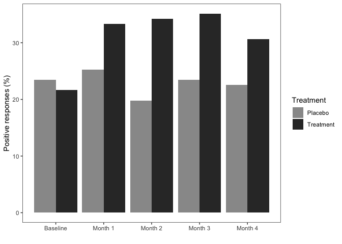

*Multivariate Analysis for the Behavioral Sciences,*  
**Examples of Chapter 10:**  
**Analysis of Longitudinal Data III: Non-Normal Responses**
================
Kimmo Vehkalahti, Brian S. Everitt; edited by C.-F. Sheu
‘08 September, 2019’

``` r
# check to see if the pacman package is there
# if not install it and then use it manage packages
if (!require(pacman)) install.packages("pacman")
pacman::p_load(tidyverse, gee, lme4, HSAUR3)
```

## Example: Respiratory Illness

The respiratory status of patients recruited for a randomised clinical
multicenter trial. In each of two centres, eligible patients were
randomly assigned to active treatment or placebo. During the treatment,
the respiratory status (categorised poor or good) was determined at each
of four, monthly visits. The trial recruited 111 participants (54 in the
active group, 57 in the placebo group) and there were no missing data
for either the responses or the covariates. The question of interest is
to assess whether the treatment is effective and to estimate its effect.

## Table 10.1: Respiratory Disorder Data

``` r
# load the data set
data("respiratory", package = "HSAUR3")
```

``` r
# view data help file
?HSAUR3::respiratory
```

``` r
# make a copy of the data set
RESPL <- respiratory # (data are in long form)
```

``` r
glimpse(RESPL); head(RESPL)
```

    Observations: 555
    Variables: 7
    $ centre    <fct> 1, 1, 1, 1, 1, 1, 1, 1, 1, 1, 1, 1, 1, 1, 1, 1, 1, 1, …
    $ treatment <fct> placebo, placebo, placebo, placebo, placebo, placebo, …
    $ gender    <fct> female, female, female, female, female, female, female…
    $ age       <dbl> 46, 46, 46, 46, 46, 28, 28, 28, 28, 28, 23, 23, 23, 23…
    $ status    <fct> poor, poor, poor, poor, poor, poor, poor, poor, poor, …
    $ month     <ord> 0, 1, 2, 3, 4, 0, 1, 2, 3, 4, 0, 1, 2, 3, 4, 0, 1, 2, …
    $ subject   <fct> 1, 1, 1, 1, 1, 2, 2, 2, 2, 2, 3, 3, 3, 3, 3, 4, 4, 4, …

``` 
    centre treatment gender age status month subject
1        1   placebo female  46   poor     0       1
112      1   placebo female  46   poor     1       1
223      1   placebo female  46   poor     2       1
334      1   placebo female  46   poor     3       1
445      1   placebo female  46   poor     4       1
2        1   placebo female  28   poor     0       2
```

``` r
# recode variable levels
# see the original article by Davis (1991)
RESPL <- within(RESPL, {
     levels(gender) <- c("male", "female") 
     # for converting to wide form below
     status <- as.numeric(status) - 1 
})
```

``` r
# convert data to WIDE form:
# (sep: set valid names month0:month4 here; otherwise just 0:4)
RESP <- RESPL %>% 
  spread(key = month, value = status, sep = "") %>% 
  arrange(subject)
```

``` r
glimpse(RESP); head(RESP)
```

    Observations: 111
    Variables: 10
    $ centre    <fct> 1, 1, 1, 1, 1, 1, 1, 1, 1, 1, 1, 1, 1, 1, 1, 1, 1, 1, …
    $ treatment <fct> placebo, placebo, treatment, placebo, placebo, treatme…
    $ gender    <fct> male, male, male, male, female, male, male, male, male…
    $ age       <dbl> 46, 28, 23, 44, 13, 34, 43, 28, 31, 37, 30, 14, 23, 30…
    $ subject   <fct> 1, 2, 3, 4, 5, 6, 7, 8, 9, 10, 11, 12, 13, 14, 15, 16,…
    $ month0    <dbl> 0, 0, 1, 1, 1, 0, 0, 0, 1, 1, 1, 0, 1, 0, 1, 0, 0, 0, …
    $ month1    <dbl> 0, 0, 1, 1, 1, 0, 1, 0, 1, 0, 1, 1, 1, 0, 1, 0, 0, 0, …
    $ month2    <dbl> 0, 0, 1, 1, 1, 0, 0, 0, 1, 1, 1, 1, 0, 0, 1, 0, 0, 1, …
    $ month3    <dbl> 0, 0, 1, 1, 1, 0, 1, 0, 1, 1, 1, 1, 0, 0, 1, 0, 0, 1, …
    $ month4    <dbl> 0, 0, 1, 0, 1, 0, 1, 0, 1, 0, 1, 0, 0, 0, 1, 1, 0, 1, …

``` 
  centre treatment gender age subject month0 month1 month2 month3 month4
1      1   placebo   male  46       1      0      0      0      0      0
2      1   placebo   male  28       2      0      0      0      0      0
3      1 treatment   male  23       3      1      1      1      1      1
4      1   placebo   male  44       4      1      1      1      1      0
5      1   placebo female  13       5      1      1      1      1      1
6      1 treatment   male  34       6      0      0      0      0      0
```

``` r
# back to long form; leave month0 for baseline:
RESPL <- gather(RESP, key = months, value = status, month1:month4) %>%
  mutate(month = as.integer(substr(months, 6, 6))) %>% 
  rename(baseline = month0) %>% 
  arrange(subject)
```

``` r
glimpse(RESPL); head(RESPL)
```

    Observations: 444
    Variables: 9
    $ centre    <fct> 1, 1, 1, 1, 1, 1, 1, 1, 1, 1, 1, 1, 1, 1, 1, 1, 1, 1, …
    $ treatment <fct> placebo, placebo, placebo, placebo, placebo, placebo, …
    $ gender    <fct> male, male, male, male, male, male, male, male, male, …
    $ age       <dbl> 46, 46, 46, 46, 28, 28, 28, 28, 23, 23, 23, 23, 44, 44…
    $ subject   <fct> 1, 1, 1, 1, 2, 2, 2, 2, 3, 3, 3, 3, 4, 4, 4, 4, 5, 5, …
    $ baseline  <dbl> 0, 0, 0, 0, 0, 0, 0, 0, 1, 1, 1, 1, 1, 1, 1, 1, 1, 1, …
    $ months    <chr> "month1", "month2", "month3", "month4", "month1", "mon…
    $ status    <dbl> 0, 0, 0, 0, 0, 0, 0, 0, 1, 1, 1, 1, 1, 1, 1, 0, 1, 1, …
    $ month     <int> 1, 2, 3, 4, 1, 2, 3, 4, 1, 2, 3, 4, 1, 2, 3, 4, 1, 2, …

``` 
  centre treatment gender age subject baseline months status month
1      1   placebo   male  46       1        0 month1      0     1
2      1   placebo   male  46       1        0 month2      0     2
3      1   placebo   male  46       1        0 month3      0     3
4      1   placebo   male  46       1        0 month4      0     4
5      1   placebo   male  28       2        0 month1      0     1
6      1   placebo   male  28       2        0 month2      0     2
```

## Figure 10.2

``` r
# compute proportions by treatment for each month
n = dim(RESP)[1]
RP <- RESP %>%
  group_by(treatment) %>%
  summarize(m0 = 100*sum(month0)/n, 
            m1 = 100*sum(month1)/n, 
            m2 = 100*sum(month2)/n, 
            m3 = 100*sum(month3)/n, 
            m4 = 100*sum(month4)/n ) %>%
  select(-treatment) %>%
  ungroup()
```

``` r
knitr::kable(RP)
```

|     m0 |     m1 |     m2 |     m3 |     m4 |
| -----: | -----: | -----: | -----: | -----: |
| 23.423 | 25.225 | 19.820 | 23.423 | 22.523 |
| 21.622 | 33.333 | 34.234 | 35.135 | 30.631 |

``` r
RP2 <- cbind(RP[1, ], RP[2, ])
month <- rep(1:5, times = 2)
treatment <- rep(0:1, each = 5)
RPos <- as.data.frame(cbind(treatment, month, t(RP2)))
row.names(RPos) <- 1:10
names(RPos) <- c("Treatment", "Month", "Positive")
RPos$Treatment <- factor(RPos$Treatment, 
                         labels = c("Placebo", "Treatment"))
```

``` r
knitr::kable(RPos)
```

| Treatment | Month | Positive |
| :-------- | ----: | -------: |
| Placebo   |     1 |   23.423 |
| Placebo   |     2 |   25.225 |
| Placebo   |     3 |   19.820 |
| Placebo   |     4 |   23.423 |
| Placebo   |     5 |   22.523 |
| Treatment |     1 |   21.622 |
| Treatment |     2 |   33.333 |
| Treatment |     3 |   34.234 |
| Treatment |     4 |   35.135 |
| Treatment |     5 |   30.631 |

``` r
ggplot(RPos, aes(x = Month, y = Positive, fill = Treatment)) +
  geom_bar(position = "dodge", stat = "identity") +
  scale_x_continuous(name = "", breaks = 1:5,
                     labels = c("Baseline", "Month 1", "Month 2", "Month 3", "Month 4")) + 
  theme_bw() + 
  theme(panel.grid.major = element_blank(),
        panel.grid.minor = element_blank()) + 
  scale_y_continuous(name = "Positive responses (%)") +
  scale_fill_grey(start = 0.6, end = 0.2)
```



## Table 10.5

``` r
resp_gee1 <- gee::gee(status ~ age, data = RESPL, 
                      family = binomial, 
                      id = subject, 
                      corstr = "independence", 
                      scale.fix = TRUE, scale.value = 1)
```

    (Intercept)         age 
       0.645763   -0.012015 

``` r
summary(resp_gee1)
```

``` 

 GEE:  GENERALIZED LINEAR MODELS FOR DEPENDENT DATA
 gee S-function, version 4.13 modified 98/01/27 (1998) 

Model:
 Link:                      Logit 
 Variance to Mean Relation: Binomial 
 Correlation Structure:     Independent 

Call:
gee::gee(formula = status ~ age, id = subject, data = RESPL, 
    family = binomial, corstr = "independence", scale.fix = TRUE, 
    scale.value = 1)

Summary of Residuals:
     Min       1Q   Median       3Q      Max 
-0.62565 -0.55087  0.38283  0.43210  0.54271 


Coefficients:
             Estimate Naive S.E. Naive z Robust S.E. Robust z
(Intercept)  0.645763   0.255301  2.5294    0.395673   1.6321
age         -0.012015   0.007061 -1.7016    0.011735  -1.0239

Estimated Scale Parameter:  1
Number of Iterations:  1

Working Correlation
     [,1] [,2] [,3] [,4]
[1,]    1    0    0    0
[2,]    0    1    0    0
[3,]    0    0    1    0
[4,]    0    0    0    1
```

## Table 10.6

``` r
resp_gee2 <- gee(status ~ age, data = RESPL, 
                 family = binomial, id = subject,
                 corstr = "exchangeable", 
                 scale.fix = TRUE, scale.value = 1)
```

    (Intercept)         age 
       0.645763   -0.012015 

``` r
summary(resp_gee2)
```

``` 

 GEE:  GENERALIZED LINEAR MODELS FOR DEPENDENT DATA
 gee S-function, version 4.13 modified 98/01/27 (1998) 

Model:
 Link:                      Logit 
 Variance to Mean Relation: Binomial 
 Correlation Structure:     Exchangeable 

Call:
gee(formula = status ~ age, id = subject, data = RESPL, family = binomial, 
    corstr = "exchangeable", scale.fix = TRUE, scale.value = 1)

Summary of Residuals:
     Min       1Q   Median       3Q      Max 
-0.62565 -0.55087  0.38283  0.43210  0.54271 


Coefficients:
             Estimate Naive S.E. Naive z Robust S.E. Robust z
(Intercept)  0.645763    0.41038  1.5736    0.395673   1.6321
age         -0.012015    0.01135 -1.0586    0.011735  -1.0239

Estimated Scale Parameter:  1
Number of Iterations:  1

Working Correlation
        [,1]    [,2]    [,3]    [,4]
[1,] 1.00000 0.52793 0.52793 0.52793
[2,] 0.52793 1.00000 0.52793 0.52793
[3,] 0.52793 0.52793 1.00000 0.52793
[4,] 0.52793 0.52793 0.52793 1.00000
```

## Table 10.7

``` r
xnam <- names(RESPL)[c(1:4,6,9)]
(fmla3 <- as.formula(paste("status ~ ", paste(xnam, collapse= "+"))))
```

    status ~ centre + treatment + gender + age + baseline + month

``` r
resp_gee3 <- gee(fmla3, data = RESPL, 
                 family = binomial, id = subject, 
                 corstr = "exchangeable", 
                 scale.fix = TRUE, scale.value = 1)
```

``` 
       (Intercept)            centre2 treatmenttreatment 
         -0.740492           0.672307           1.300557 
      genderfemale                age           baseline 
          0.119367          -0.018185           1.884061 
             month 
         -0.064251 
```

``` r
summary(resp_gee3)
```

``` 

 GEE:  GENERALIZED LINEAR MODELS FOR DEPENDENT DATA
 gee S-function, version 4.13 modified 98/01/27 (1998) 

Model:
 Link:                      Logit 
 Variance to Mean Relation: Binomial 
 Correlation Structure:     Exchangeable 

Call:
gee(formula = fmla3, id = subject, data = RESPL, family = binomial, 
    corstr = "exchangeable", scale.fix = TRUE, scale.value = 1)

Summary of Residuals:
      Min        1Q    Median        3Q       Max 
-0.933361 -0.297312  0.087095  0.329045  0.855910 


Coefficients:
                    Estimate Naive S.E.  Naive z Robust S.E. Robust z
(Intercept)        -0.733238   0.517772 -1.41614    0.519020 -1.41274
centre2             0.680916   0.339605  2.00502    0.356760  1.90861
treatmenttreatment  1.292221   0.335630  3.85014    0.350536  3.68642
genderfemale        0.130765   0.417913  0.31290    0.444098  0.29445
age                -0.018411   0.012570 -1.46472    0.013012 -1.41498
baseline            1.877814   0.341897  5.49234    0.350098  5.36368
month              -0.064200   0.081004 -0.79255    0.081509 -0.78764

Estimated Scale Parameter:  1
Number of Iterations:  2

Working Correlation
        [,1]    [,2]    [,3]    [,4]
[1,] 1.00000 0.33692 0.33692 0.33692
[2,] 0.33692 1.00000 0.33692 0.33692
[3,] 0.33692 0.33692 1.00000 0.33692
[4,] 0.33692 0.33692 0.33692 1.00000
```

## Table 10.10

``` r
# set up the model formula for lme4
(fmla4 <- as.formula(paste("status ~ ", 
                           paste0(paste(xnam, collapse = "+"), 
                                  " + (1 | subject)"))))
```

    status ~ centre + treatment + gender + age + baseline + month + 
        (1 | subject)

``` r
resp_glmer <- lme4::glmer(fmla4, data = RESPL, family = binomial)
```

``` r
summary(resp_glmer)
```

    Generalized linear mixed model fit by maximum likelihood (Laplace
      Approximation) [glmerMod]
     Family: binomial  ( logit )
    Formula: status ~ centre + treatment + gender + age + baseline + month +  
        (1 | subject)
       Data: RESPL
    
         AIC      BIC   logLik deviance df.resid 
       444.3    477.1   -214.2    428.3      436 
    
    Scaled residuals: 
       Min     1Q Median     3Q    Max 
    -2.857 -0.359  0.143  0.369  2.239 
    
    Random effects:
     Groups  Name        Variance Std.Dev.
     subject (Intercept) 3.89     1.97    
    Number of obs: 444, groups:  subject, 111
    
    Fixed effects:
                       Estimate Std. Error z value Pr(>|z|)
    (Intercept)         -1.3958     0.8383   -1.67   0.0959
    centre2              1.0467     0.5478    1.91   0.0561
    treatmenttreatment   2.1632     0.5564    3.89   0.0001
    genderfemale         0.2025     0.6727    0.30   0.7634
    age                 -0.0255     0.0201   -1.26   0.2061
    baseline             3.0783     0.6027    5.11  3.3e-07
    month               -0.1013     0.1252   -0.81   0.4182
    
    Correlation of Fixed Effects:
                (Intr) centr2 trtmnt gndrfm age    baseln
    centre2     -0.078                                   
    trtmnttrtmn -0.395  0.058                            
    genderfemal -0.008 -0.147  0.219                     
    age         -0.670 -0.223 -0.050 -0.263              
    baseline    -0.349 -0.150  0.301  0.102  0.015       
    month       -0.356 -0.015 -0.031 -0.003  0.009 -0.041

## Session information
