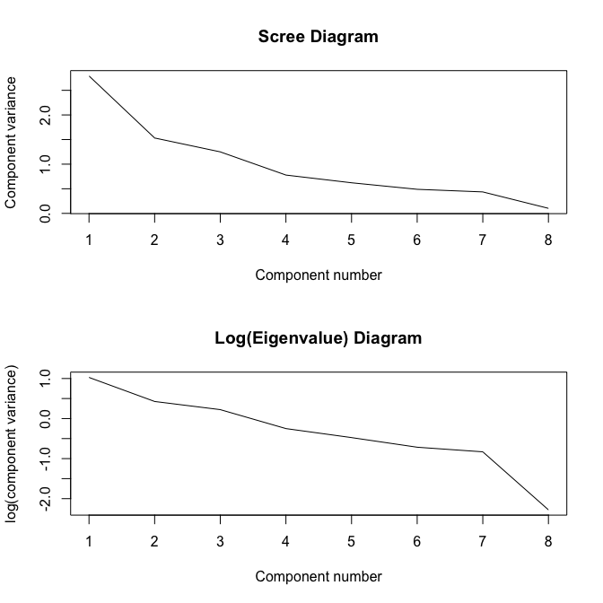

*Multivariate Analysis for the Behavioral Sciences,*  
**Examples of Chapter 13:**  
**Principal Components Analysis**
================
Kimmo Vehkalahti, Brian S. Everitt; edited by C.-F. Sheu
10 September, 2019

``` r
# check to see if the pacman package is there
# if not install it and then use it manage packages
if (!require(pacman)) install.packages("pacman")
pacman::p_load(tidyverse)
```

## Example: Blood Chemistry

The data consist of eight blood chemistry variables measured on 72
patients in a clinical trial. The correlation matrix of the data,
together with the standard deviations of each of the eight variables, is
available.

## Table 13.1: Correlations of Blood Chemistry Variables and Their Standard Deviations

``` r
# correlation matrix
blood_corr <- matrix(c(1.000, 0.290, 0.202,-0.055,-0.105,-0.252,-0.229, 0.058,
                0.290, 1.000, 0.415, 0.285,-0.376,-0.349,-0.164,-0.129,
                0.202, 0.415, 1.000, 0.419,-0.521,-0.441,-0.145,-0.076,
               -0.055, 0.285, 0.419, 1.000,-0.877,-0.076, 0.023,-0.131,
               -0.105,-0.376,-0.521,-0.877, 1.000, 0.206, 0.034, 0.151,
               -0.252,-0.349,-0.441,-0.076, 0.206, 1.000, 0.192, 0.077,
               -0.229,-0.164,-0.145, 0.023, 0.034, 0.192, 1.000, 0.423,
                0.058,-0.129,-0.076,-0.131, 0.151, 0.077, 0.423, 1.000), ncol = 8)
names <- c("rBlood", "Plate", "wBlood", "Neut.", "Lymph", "Bilir.", "Sodium", "Potass.")
dimnames(blood_corr) <- list(names, names)
blood_corr
```

``` 
        rBlood  Plate wBlood  Neut.  Lymph Bilir. Sodium Potass.
rBlood   1.000  0.290  0.202 -0.055 -0.105 -0.252 -0.229   0.058
Plate    0.290  1.000  0.415  0.285 -0.376 -0.349 -0.164  -0.129
wBlood   0.202  0.415  1.000  0.419 -0.521 -0.441 -0.145  -0.076
Neut.   -0.055  0.285  0.419  1.000 -0.877 -0.076  0.023  -0.131
Lymph   -0.105 -0.376 -0.521 -0.877  1.000  0.206  0.034   0.151
Bilir.  -0.252 -0.349 -0.441 -0.076  0.206  1.000  0.192   0.077
Sodium  -0.229 -0.164 -0.145  0.023  0.034  0.192  1.000   0.423
Potass.  0.058 -0.129 -0.076 -0.131  0.151  0.077  0.423   1.000
```

``` r
# standard deviations
sds <- c(0.371, 41.253, 1.935, 0.077, 0.071, 4.037, 2.732, 0.297)
diag(sds)
```

``` 
      [,1]   [,2]  [,3]  [,4]  [,5]  [,6]  [,7]  [,8]
[1,] 0.371  0.000 0.000 0.000 0.000 0.000 0.000 0.000
[2,] 0.000 41.253 0.000 0.000 0.000 0.000 0.000 0.000
[3,] 0.000  0.000 1.935 0.000 0.000 0.000 0.000 0.000
[4,] 0.000  0.000 0.000 0.077 0.000 0.000 0.000 0.000
[5,] 0.000  0.000 0.000 0.000 0.071 0.000 0.000 0.000
[6,] 0.000  0.000 0.000 0.000 0.000 4.037 0.000 0.000
[7,] 0.000  0.000 0.000 0.000 0.000 0.000 2.732 0.000
[8,] 0.000  0.000 0.000 0.000 0.000 0.000 0.000 0.297
```

## Table 13.2

``` r
# Calculate the covariance matrix from correlations and sds:
blood_cov <- diag(sds) %*% blood_corr %*% diag(sds)
dimnames(blood_cov) <- list(names, names)
round(blood_cov, 2)
```

``` 
        rBlood   Plate wBlood Neut. Lymph Bilir. Sodium Potass.
rBlood    0.14    4.44   0.15  0.00  0.00  -0.38  -0.23    0.01
Plate     4.44 1701.81  33.13  0.91 -1.10 -58.12 -18.48   -1.58
wBlood    0.15   33.13   3.74  0.06 -0.07  -3.44  -0.77   -0.04
Neut.     0.00    0.91   0.06  0.01  0.00  -0.02   0.00    0.00
Lymph     0.00   -1.10  -0.07  0.00  0.01   0.06   0.01    0.00
Bilir.   -0.38  -58.12  -3.44 -0.02  0.06  16.30   2.12    0.09
Sodium   -0.23  -18.48  -0.77  0.00  0.01   2.12   7.46    0.34
Potass.   0.01   -1.58  -0.04  0.00  0.00   0.09   0.34    0.09
```

``` r
# pca based on covariance matrix
blood_pcacov <- princomp(covmat = blood_cov)
# summarize the results
summary(blood_pcacov, loadings = TRUE)
```

``` 
Importance of components:
                         Comp.1    Comp.2    Comp.3   Comp.4     Comp.5
Standard deviation     41.28775 3.8802126 2.6419734 1.624584 3.5395e-01
Proportion of Variance  0.98562 0.0087052 0.0040357 0.001526 7.2436e-05
Cumulative Proportion   0.98562 0.9943234 0.9983591 0.999885 9.9996e-01
                           Comp.6     Comp.7     Comp.8
Standard deviation     2.5617e-01 8.5106e-02 2.3727e-02
Proportion of Variance 3.7943e-05 4.1878e-06 3.2550e-07
Cumulative Proportion  1.0000e+00 1.0000e+00 1.0000e+00

Loadings:
        Comp.1 Comp.2 Comp.3 Comp.4 Comp.5 Comp.6 Comp.7 Comp.8
rBlood                               0.943  0.329              
Plate    0.999                                                 
wBlood          0.192         0.981                            
Neut.                                              0.758  0.650
Lymph                                             -0.649  0.760
Bilir.         -0.961  0.195  0.191                            
Sodium         -0.193 -0.979                                   
Potass.                              0.329 -0.942              
```

## Table 13.3

``` r
# pca based on correlation matrix
blood_pcacor <- princomp(covmat = blood_corr)
summary(blood_pcacor, loadings = TRUE)
```

``` 
Importance of components:
                        Comp.1  Comp.2  Comp.3   Comp.4   Comp.5   Comp.6
Standard deviation     1.67101 1.23758 1.11771 0.882274 0.788395 0.699173
Proportion of Variance 0.34903 0.19145 0.15616 0.097301 0.077696 0.061105
Cumulative Proportion  0.34903 0.54049 0.69665 0.793948 0.871644 0.932749
                         Comp.7   Comp.8
Standard deviation     0.660024 0.319962
Proportion of Variance 0.054454 0.012797
Cumulative Proportion  0.987203 1.000000

Loadings:
        Comp.1 Comp.2 Comp.3 Comp.4 Comp.5 Comp.6 Comp.7 Comp.8
rBlood   0.194  0.417  0.400  0.652  0.175  0.363  0.176  0.102
Plate    0.400  0.154  0.168        -0.848 -0.230 -0.110       
wBlood   0.459         0.168 -0.274  0.251 -0.403  0.677       
Neut.    0.430 -0.472 -0.171  0.169  0.118        -0.237  0.678
Lymph   -0.494  0.360        -0.180 -0.139 -0.136  0.157  0.724
Bilir.  -0.319 -0.320 -0.277  0.633 -0.162 -0.384  0.377       
Sodium  -0.177 -0.535  0.410 -0.163 -0.299  0.513  0.367       
Potass. -0.171 -0.245  0.709         0.198 -0.469 -0.376       
```

## Figure 13.1

``` r
# scree plots
par(mfrow = c(2,1))
plot(1:8, blood_pcacor$sdev^2, type = "l", 
     xlab = "Component number", 
     ylab = "Component variance", 
     main = "Scree Diagram")
#
plot(1:8, log(blood_pcacor$sdev^2), type = "l", 
     xlab = "Component number", 
     ylab = "log(component variance)", 
     main = "Log(Eigenvalue) Diagram")
```



## Session information
