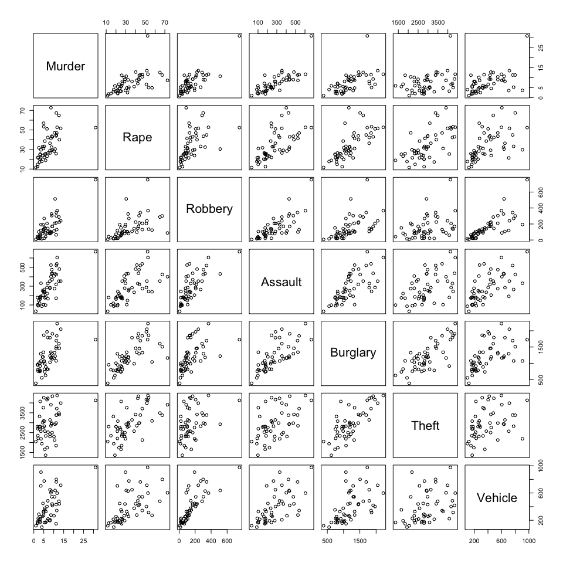
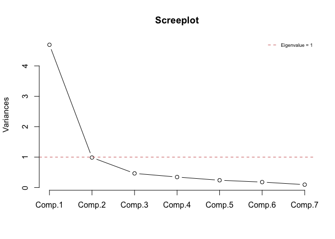
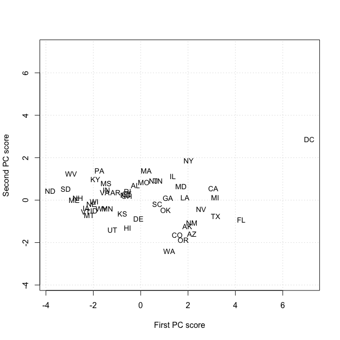
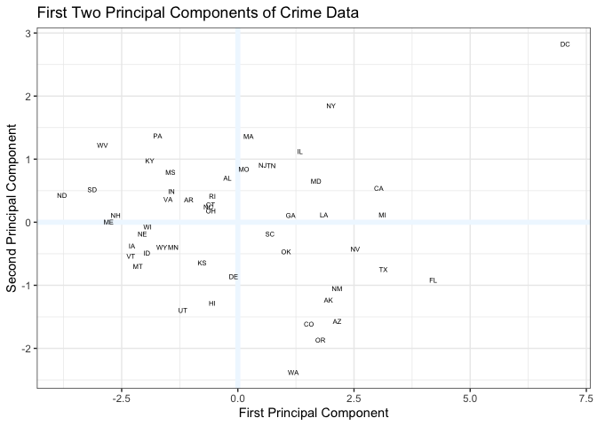
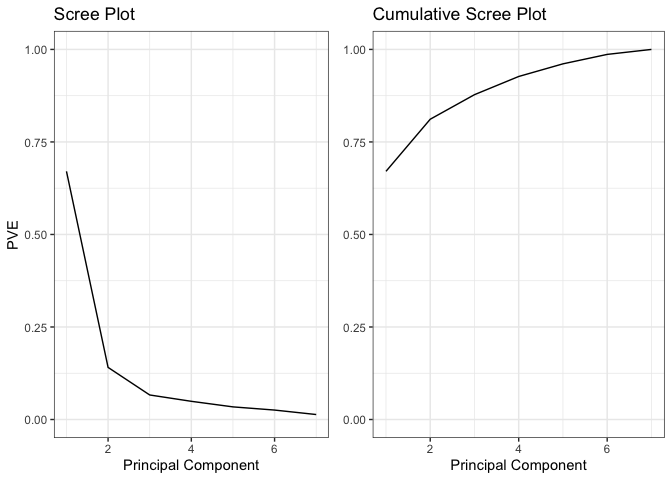
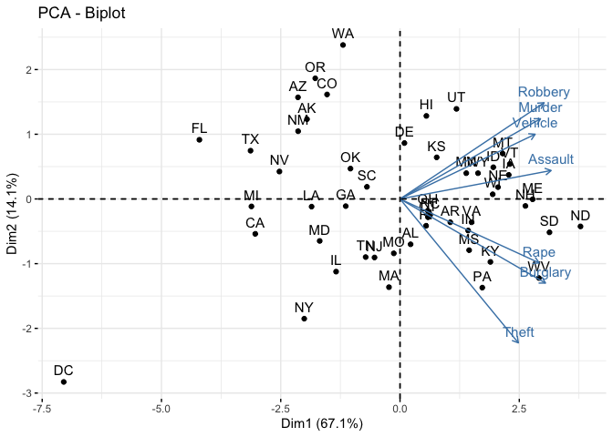

*Multivariate Analysis for the Behavioral Sciences,*  
**Examples of Chapter 13:**  
**Principal Components Analysis**
================
Kimmo Vehkalahti, Brian S. Everitt; edited by C.-F. Sheu
10 September, 2019

``` r
# check to see if the pacman package is there
# if not install it and then use it manage packages
if (!require(pacman)) install.packages("pacman")
pacman::p_load(tidyverse, gridExtra, factoextra)
```

## Example: Crime Rates

The Statistical Abstract of the USA (1988) gives rates of different
types of crime per 100,000 residents of 50 states of the United States
plus the District of Columbia for the year
1986.

## Table 13.5: Crime Rates in the United States

``` r
fLoc <- "https://raw.githubusercontent.com/KimmoVehkalahti/MABS/master/Examples/data/crime.txt"
crime <- read.table(file = fLoc, header = T, sep = '\t')
glimpse(crime)
```

    Observations: 51
    Variables: 7
    $ Murder   <dbl> 2.0, 2.2, 2.0, 3.6, 3.5, 4.6, 10.7, 5.2, 5.5, 5.5, 6.0,…
    $ Rape     <dbl> 14.8, 21.5, 21.8, 29.7, 21.4, 23.8, 30.5, 33.2, 25.1, 3…
    $ Robbery  <int> 28, 24, 22, 193, 119, 192, 514, 269, 152, 142, 90, 325,…
    $ Assault  <int> 102, 92, 103, 331, 192, 205, 431, 265, 176, 235, 186, 4…
    $ Burglary <int> 803, 755, 949, 1071, 1294, 1198, 1221, 1071, 735, 988, …
    $ Theft    <int> 2347, 2208, 2697, 2189, 2568, 2758, 2924, 2822, 1654, 2…
    $ Vehicle  <int> 164, 228, 181, 906, 705, 447, 637, 776, 354, 376, 328, …

## Figure 13.4

``` r
pairs(crime)
```



## Table 13.6

``` r
crime_pc <- princomp(crime, cor = TRUE)
summary(crime_pc, loadings = TRUE)
```

    Importance of components:
                            Comp.1  Comp.2   Comp.3   Comp.4  Comp.5   Comp.6
    Standard deviation     2.16659 0.99278 0.681378 0.586661 0.48886 0.422699
    Proportion of Variance 0.67059 0.14080 0.066325 0.049167 0.03414 0.025525
    Cumulative Proportion  0.67059 0.81139 0.877714 0.926881 0.96102 0.986546
                             Comp.7
    Standard deviation     0.306884
    Proportion of Variance 0.013454
    Cumulative Proportion  1.000000
    
    Loadings:
             Comp.1 Comp.2 Comp.3 Comp.4 Comp.5 Comp.6 Comp.7
    Murder    0.381  0.350  0.538         0.274  0.370  0.480
    Rape      0.377 -0.279        -0.830  0.250        -0.151
    Robbery   0.391  0.420 -0.131  0.275  0.387        -0.651
    Assault   0.410  0.124  0.335        -0.564 -0.620       
    Burglary  0.394 -0.367         0.162 -0.466  0.622 -0.283
    Theft     0.321 -0.628         0.449  0.388 -0.282  0.256
    Vehicle   0.366  0.282 -0.758        -0.163         0.422

## Figure 13.5

``` r
screeplot(crime_pc, type = "l", npcs = 7, main = "Screeplot")
abline(h = 1, col = "indianred", lty = 2)
legend("topright", legend = "Eigenvalue = 1", bty = "n", 
       col = "indianred", lty = 2, cex = 0.6)
```



``` r
#plot(1:7, crime_pc$sdev^2, type = "l", 
#     xlab = "Component Number", ylab = "Variance")
```

## Figure 13.6

``` r
xlim <- range(crime_pc$scores[, 1])
plot(crime_pc$scores[, 1], crime_pc$scores[, 2], type = "n",
     xlab = "First PC score", 
     ylab = "Second PC score", xlim = xlim, ylim = xlim)
grid()
text(crime_pc$scores[, 1], crime_pc$scores[, 2], 
     row.names(crime), cex = 0.9) 
```



## Table 13.7

``` r
options(digits = 3)
# use all pcas to get original correlation matrix
lambda <- crime_pc$sdev^2
Astar <- crime_pc$loadings[1:7, 1:7]
R <- Astar %*% diag(lambda) %*% t(Astar)
R
```

``` 
         Murder  Rape Robbery Assault Burglary Theft Vehicle
Murder    1.000 0.578   0.804   0.781    0.581 0.361   0.573
Rape      0.578 1.000   0.530   0.659    0.721 0.635   0.569
Robbery   0.804 0.530   1.000   0.740    0.551 0.400   0.786
Assault   0.781 0.659   0.740   1.000    0.710 0.512   0.638
Burglary  0.581 0.721   0.551   0.710    1.000 0.764   0.579
Theft     0.361 0.635   0.400   0.512    0.764 1.000   0.386
Vehicle   0.573 0.569   0.786   0.638    0.579 0.386   1.000
```

``` r
# predicted correlation matrix based on first two components
lambda2 <- lambda[1:2]
Astar2 <- Astar[,1:2]
R2 <- Astar2 %*% diag(lambda2) %*% t(Astar2)
R2
```

``` 
         Murder  Rape Robbery Assault Burglary Theft Vehicle
Murder    0.801 0.578   0.843   0.775    0.578 0.357   0.752
Rape      0.578 0.745   0.576   0.691    0.799 0.741   0.571
Robbery   0.843 0.576   0.889   0.802    0.571 0.328   0.788
Assault   0.775 0.691   0.802   0.803    0.713 0.540   0.739
Burglary  0.578 0.799   0.571   0.713    0.862 0.821   0.576
Theft     0.357 0.741   0.328   0.540    0.821 0.872   0.377
Vehicle   0.752 0.571   0.788   0.739    0.576 0.377   0.708
```

What follows is not available in the textbook.

``` r
# compute variance of each variable
apply(crime, 2, var)
```

``` 
  Murder     Rape  Robbery  Assault Burglary    Theft  Vehicle 
    23.2    212.3  18993.4  22004.3 177912.8 582812.8  50007.4 
```

``` r
# create new data frame with centered variables
z_crime <- apply(crime, 2, scale)
round(head(z_crime), 3)
```

``` 
     Murder   Rape Robbery Assault Burglary  Theft Vehicle
[1,] -1.090 -1.333  -0.915  -1.223   -0.958 -0.779  -1.028
[2,] -1.049 -0.873  -0.944  -1.290   -1.072 -0.961  -0.742
[3,] -1.090 -0.852  -0.959  -1.216   -0.612 -0.321  -0.952
[4,] -0.758 -0.310   0.282   0.321   -0.323 -0.986   2.290
[5,] -0.779 -0.880  -0.255  -0.616    0.206 -0.490   1.391
[6,] -0.550 -0.715   0.275  -0.528   -0.022 -0.241   0.238
```

``` r
# Calculate eigenvalues & eigenvectors
crime.cov <- cov(z_crime)
crime.eigen <- eigen(crime.cov)
```

``` r
# extract loadings, flip the sign
# by default, eigenvectors in R point in the negative direction
phi <- -crime.eigen$vectors[, 1:2]
row.names(phi) <- names(crime)
colnames(phi) <- c("PC1", "PC2")
phi
```

``` 
           PC1    PC2
Murder   0.381  0.350
Rape     0.377 -0.279
Robbery  0.391  0.420
Assault  0.410  0.124
Burglary 0.394 -0.367
Theft    0.321 -0.628
Vehicle  0.366  0.282
```

``` r
# Calculate Principal Components scores
PC1 <- as.matrix(z_crime) %*% phi[,1]
PC2 <- as.matrix(z_crime) %*% phi[,2]

# Create data frame with Principal Components scores
PC <- data.frame(State = row.names(crime), PC1, PC2)
head(PC)
```

``` 
  State    PC1      PC2
1    ME -2.780  0.00522
2    NH -2.628  0.10783
3    VT -2.302 -0.53951
4    MA  0.231  1.36349
5    RI -0.546  0.41416
6    CT -0.587  0.28295
```

``` r
# Plot Principal Components for each State
ggplot(PC, aes(PC1, PC2)) + 
  modelr::geom_ref_line(h = 0, col="aliceblue") +
  modelr::geom_ref_line(v = 0, col="aliceblue") +
  geom_text(aes(label = State), size = rel(2)) +
  labs(x = "First Principal Component",
       y ="Second Principal Component", 
       title = "First Two Principal Components of Crime Data") +
  theme_bw()
```



``` r
# proportion of variance explained
PVE <- crime.eigen$values / sum(crime.eigen$values)
round(PVE, 2)
```

    [1] 0.67 0.14 0.07 0.05 0.03 0.03 0.01

``` r
# PVE (aka scree) plot
PVEplot <- ggplot(data.frame(x=c(1:length(PVE)), y=PVE), aes(x,y)) + 
  geom_line() + 
  labs(x = "Principal Component", y = "PVE", title = "Scree Plot") +
  ylim(0, 1) +
  theme_bw()
# Cumulative PVE plot
cumPVE <- ggplot(data.frame(x=c(1:length(PVE)), y=cumsum(PVE)), aes(x,y)) + 
  geom_line() + 
  labs(x = "Principal Component", y = NULL, 
       title = "Cumulative Scree Plot") +
  ylim(0,1) +
  theme_bw()
# 1-row, 2-col, side by side arrangement 
grid.arrange(PVEplot, cumPVE, ncol = 2)
```



``` r
pca_crime <- prcomp(crime, scale = TRUE)
names(pca_crime)
```

``` 
[1] "sdev"     "rotation" "center"   "scale"    "x"       
```

``` r
# means
pca_crime$center
```

``` 
  Murder     Rape  Robbery  Assault Burglary    Theft  Vehicle 
    7.25    34.22   154.10   283.35  1207.08  2941.96   393.84 
```

``` r
# standard deviations
pca_crime$scale
```

``` 
  Murder     Rape  Robbery  Assault Burglary    Theft  Vehicle 
    4.82    14.57   137.82   148.34   421.80   763.42   223.62 
```

``` r
# The rotation matrix provides the principal component loadings
# flip the sign
-pca_crime$rotation
```

``` 
            PC1    PC2     PC3     PC4    PC5     PC6      PC7
Murder   -0.381 -0.350  0.5380 -0.0322  0.274  0.3700  0.47969
Rape     -0.377  0.279  0.0180  0.8304  0.250 -0.0688 -0.15060
Robbery  -0.391 -0.420 -0.1311 -0.2746  0.387 -0.0750 -0.65077
Assault  -0.410 -0.124  0.3353 -0.0316 -0.564 -0.6204  0.00747
Burglary -0.394  0.367  0.0117 -0.1618 -0.466  0.6218 -0.28270
Theft    -0.321  0.628 -0.0772 -0.4488  0.388 -0.2824  0.25576
Vehicle  -0.366 -0.282 -0.7580  0.0736 -0.163  0.0379  0.42229
```

``` r
pca_crime$x <- - pca_crime$x
head(pca_crime$x)
```

``` 
      PC1      PC2     PC3    PC4     PC5    PC6     PC7
ME  2.780 -0.00522 -0.0723 -0.353  0.0146  0.101 -0.0985
NH  2.628 -0.10783 -0.2647  0.159  0.1037  0.120 -0.0230
VT  2.302  0.53951 -0.1447 -0.198  0.1184  0.156 -0.0909
MA -0.231 -1.36349 -2.0063  0.343 -0.9625 -0.315  0.3079
RI  0.546 -0.41416 -1.6223 -0.327 -0.6972  0.493  0.3241
CT  0.587 -0.28295 -0.6839 -0.506 -0.0475  0.216 -0.2944
```

``` r
# biplot(pca_crime, scale = 0, choice = 1:2)
fviz_pca(pca_crime)
```



``` r
# variances
(VE <- pca_crime$sdev^2)
```

    [1] 4.6941 0.9856 0.4643 0.3442 0.2390 0.1787 0.0942

``` r
# proportions of variance explained
VE/sum(VE)
```

    [1] 0.6706 0.1408 0.0663 0.0492 0.0341 0.0255 0.0135

## Session information
