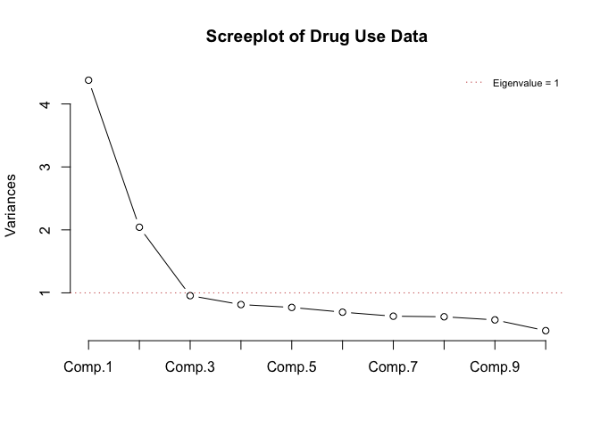

*Multivariate Analysis for the Behavioral Sciences,*  
**Examples of Chapter 13:**  
**Principal Components Analysis**
================
Kimmo Vehkalahti, Brian S. Everitt; edited by C.-F. Sheu
10 September, 2019

``` r
# check to see if the pacman package is there
# if not install it and then use it manage packages
if (!require(pacman)) install.packages("pacman")
pacman::p_load(tidyverse, calibrate)
```

## Example: Drug usage

Data on drug usage rates for 1,634 students in the seventh to ninth
grades in 11 schools in the greater metropolitan area of Los Angeles.
Each participant completed a questionnaire about the number of times (on
a five-point scale) a particular substance (out of 11) had ever been
used.

## Table 13.8: Correlation Matrix for Drug Usage Data

``` r
source("https://www.york.ac.uk/depts/maths/data/everitt/chap4druguse.dat")
druguse.cor
```

``` 
                      cigarettes  beer  wine liquor cocaine tranquillizers
cigarettes                 1.000 0.447 0.422  0.435   0.114          0.203
beer                       0.447 1.000 0.619  0.604   0.068          0.146
wine                       0.422 0.619 1.000  0.583   0.053          0.139
liquor                     0.435 0.604 0.583  1.000   0.115          0.258
cocaine                    0.114 0.068 0.053  0.115   1.000          0.349
tranquillizers             0.203 0.146 0.139  0.258   0.349          1.000
drug store medication      0.091 0.103 0.110  0.122   0.209          0.221
heroin                     0.082 0.063 0.066  0.097   0.321          0.355
marijuana                  0.513 0.445 0.365  0.482   0.186          0.315
hashish                    0.304 0.318 0.240  0.368   0.303          0.377
inhalants                  0.245 0.203 0.183  0.255   0.272          0.323
haluucinogenics            0.101 0.088 0.074  0.139   0.279          0.367
amphetamine                0.245 0.199 0.184  0.293   0.278          0.545
                      drug store medication heroin marijuana hashish
cigarettes                            0.091  0.082     0.513   0.304
beer                                  0.103  0.063     0.445   0.318
wine                                  0.110  0.066     0.365   0.240
liquor                                0.122  0.097     0.482   0.368
cocaine                               0.209  0.321     0.186   0.303
tranquillizers                        0.221  0.355     0.315   0.377
drug store medication                 1.000  0.201     0.150   0.163
heroin                                0.201  1.000     0.154   0.219
marijuana                             0.150  0.154     1.000   0.534
hashish                               0.163  0.219     0.534   1.000
inhalants                             0.310  0.288     0.301   0.302
haluucinogenics                       0.232  0.320     0.204   0.368
amphetamine                           0.232  0.314     0.394   0.467
                      inhalants haluucinogenics amphetamine
cigarettes                0.245           0.101       0.245
beer                      0.203           0.088       0.199
wine                      0.183           0.074       0.184
liquor                    0.255           0.139       0.293
cocaine                   0.272           0.279       0.278
tranquillizers            0.323           0.367       0.545
drug store medication     0.310           0.232       0.232
heroin                    0.288           0.320       0.314
marijuana                 0.301           0.204       0.394
hashish                   0.302           0.368       0.467
inhalants                 1.000           0.340       0.392
haluucinogenics           0.304           1.000       0.511
amphetamine               0.392           0.511       1.000
```

## Table 13.9

``` r
options(digits = 3)
drugs_pc <- princomp(covmat = druguse.cor)
print(drugs_pc)
```

    Call:
    princomp(covmat = druguse.cor)
    
    Standard deviations:
     Comp.1  Comp.2  Comp.3  Comp.4  Comp.5  Comp.6  Comp.7  Comp.8  Comp.9 
      2.092   1.429   0.978   0.902   0.877   0.833   0.793   0.788   0.756 
    Comp.10 Comp.11 Comp.12 Comp.13 
      0.632   0.627   0.612   0.602 
    
     13  variables and  NA observations.

``` r
summary(drugs_pc, loadings=TRUE)
```

    Importance of components:
                           Comp.1 Comp.2 Comp.3 Comp.4 Comp.5 Comp.6 Comp.7
    Standard deviation      2.092  1.429 0.9775 0.9022 0.8768 0.8327 0.7934
    Proportion of Variance  0.337  0.157 0.0735 0.0626 0.0591 0.0533 0.0484
    Cumulative Proportion   0.337  0.494 0.5672 0.6298 0.6890 0.7423 0.7907
                           Comp.8 Comp.9 Comp.10 Comp.11 Comp.12 Comp.13
    Standard deviation     0.7875 0.7556  0.6322  0.6271  0.6116  0.6019
    Proportion of Variance 0.0477 0.0439  0.0307  0.0302  0.0288  0.0279
    Cumulative Proportion  0.8385 0.8824  0.9131  0.9434  0.9721  1.0000
    
    Loadings:
                          Comp.1 Comp.2 Comp.3 Comp.4 Comp.5 Comp.6 Comp.7
    cigarettes             0.279  0.279                0.335  0.385  0.127
    beer                   0.287  0.396 -0.123  0.103 -0.187 -0.144 -0.107
    wine                   0.266  0.392 -0.212  0.145 -0.320 -0.139       
    liquor                 0.318  0.324               -0.184 -0.128       
    cocaine                0.208 -0.290         0.578  0.422 -0.434 -0.190
    tranquillizers         0.293 -0.261  0.164        -0.121         0.614
    drug store medication  0.176 -0.190 -0.722 -0.374  0.172 -0.275  0.320
    heroin                 0.202 -0.317 -0.153  0.536 -0.298  0.385       
    marijuana              0.340  0.162  0.229 -0.116  0.362  0.110       
    hashish                0.329         0.351 -0.125  0.234 -0.261 -0.160
    inhalants              0.274 -0.162 -0.328 -0.162  0.163  0.511 -0.489
    haluucinogenics        0.246 -0.327  0.142 -0.267 -0.387 -0.193 -0.399
    amphetamine            0.329 -0.234  0.234 -0.265 -0.208         0.126
                          Comp.8 Comp.9 Comp.10 Comp.11 Comp.12 Comp.13
    cigarettes             0.138  0.646  0.139   0.154   0.208   0.204 
    beer                                 0.102          -0.653   0.470 
    wine                                 0.430  -0.216   0.182  -0.554 
    liquor                -0.160 -0.182 -0.628   0.162   0.481   0.160 
    cocaine               -0.230  0.211         -0.162                 
    tranquillizers        -0.422         0.106   0.416  -0.179  -0.154 
    drug store medication  0.245                                       
    heroin                 0.518 -0.172                                
    marijuana              0.270 -0.164 -0.372  -0.232  -0.357  -0.468 
    hashish                0.272 -0.422  0.442   0.243   0.280   0.130 
    inhalants             -0.413 -0.226                                
    haluucinogenics        0.192  0.450 -0.183   0.277  -0.110  -0.183 
    amphetamine           -0.181                -0.706           0.320 

## Figure 13.7

``` r
# plot(1:13, drugs_pc$sdev^2, type = "l", 
#      xlab = "Component Number", ylab = "Variance")
screeplot(drugs_pc, type = "lines", 
          main = "Screeplot of Drug Use Data")
abline(h = 1, col = "indianred", lty = 3)
legend("topright", legend = "Eigenvalue = 1", bty = "n", 
       col = "indianred", lty = 3, cex = 0.7)
```



## Session information
