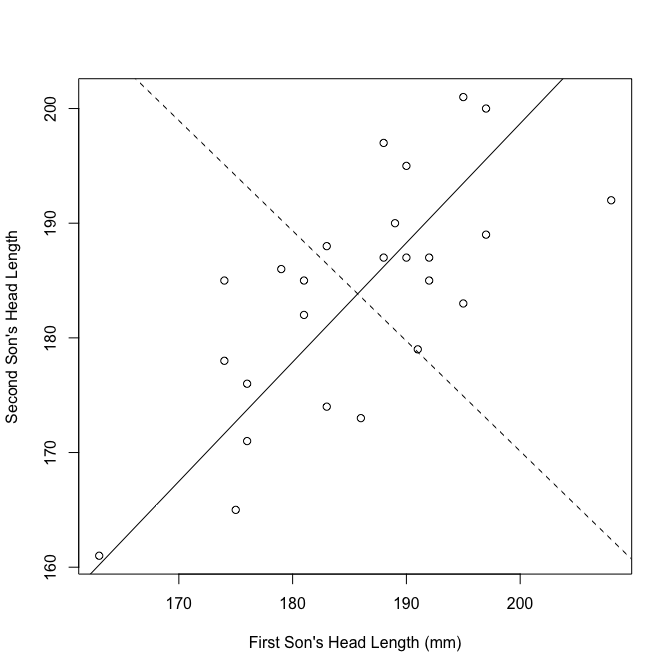
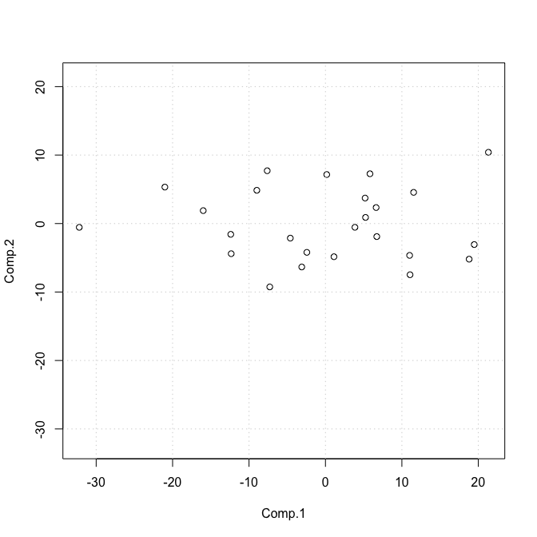
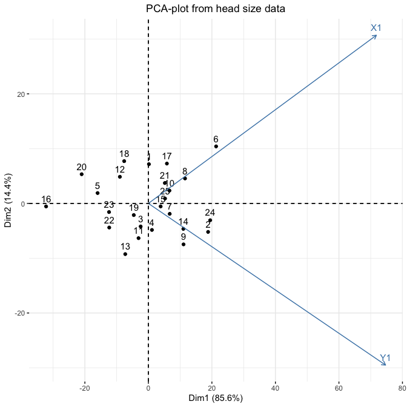

*Multivariate Analysis for the Behavioral Sciences,*  
**Examples of Chapter 13:**  
**Principal Components Analysis**
================
Kimmo Vehkalahti, Brian S. Everitt; edited by C.-F. Sheu
11 September, 2019

``` r
# check to see if the pacman package is there
# if not install it and then use it manage packages
if (!require(pacman)) install.packages("pacman")
pacman::p_load(tidyverse, calibrate, factoextra)
```

## Example: Head size

In the data set, variables X1 and X2 are the head length (in
millimeters) and head breadth of the first son and Y1 and Y2 are the
same variables for the second son of 25 families

Frets, G.P. (1921). Heredity of head form in man, *Genetica 3*,
pp. 193-384.

## Table 13.4: Head Lengths of First and Second Sons

``` r
data(heads, package = "calibrate")
head_dat <- heads[,c(1,3)]
glimpse(head_dat)
```

    Observations: 25
    Variables: 2
    $ X1 <int> 191, 195, 181, 183, 176, 208, 189, 197, 188, 192, 179, 183, 1…
    $ Y1 <int> 179, 201, 185, 188, 171, 192, 190, 189, 197, 187, 186, 174, 1…

``` r
apply(head_dat, 2, mean)
```

``` 
    X1     Y1 
185.72 183.84 
```

``` r
# covariance matrix of the heads data set
cov(head_dat)
```

``` 
       X1      Y1
X1 95.293  69.662
Y1 69.662 100.807
```

``` r
# get principal components
head_pc <- princomp(covmat = var(head_dat))
head_pc
```

    Call:
    princomp(covmat = var(head_dat))
    
    Standard deviations:
    Comp.1 Comp.2 
    12.952  5.323 
    
     2  variables and  NA observations.

``` r
print(summary(head_pc), digits = 3, loadings = TRUE)
```

    Importance of components:
                             Comp.1  Comp.2
    Standard deviation     12.95246 5.32295
    Proportion of Variance  0.85551 0.14449
    Cumulative Proportion   0.85551 1.00000
    
    Loadings:
       Comp.1 Comp.2
    X1  0.693  0.721
    Y1  0.721 -0.693

``` r
head_pc1 <- princomp(head_dat, scores = TRUE)
head_pc1
```

    Call:
    princomp(x = head_dat, scores = TRUE)
    
    Standard deviations:
     Comp.1  Comp.2 
    12.6908  5.2154 
    
     2  variables and  25 observations.

``` r
# pc scores for first family
head_pc1$scores[1, ]
```

``` 
 Comp.1  Comp.2 
0.16956 7.16067 
```

``` r
# first component score for first family
head_pc1$loadings[1,] %*% t(head_dat[1,] - c(mean(head_dat[,1]), mean(head_dat[,2])))
```

``` 
           1
[1,] 0.16956
```

``` r
# second component score for first family
head_pc1$loadings[2,] %*% t(head_dat[1,] - c(mean(head_dat[,1]), mean(head_dat[,2])))
```

``` 
          1
[1,] 7.1607
```

``` r
# reproduce covariance matrix from sdev and loadings
X <- cbind(head_pc$sdev[1] * head_pc$loadings[1,],
           head_pc$sdev[2] * head_pc$loadings[2,])
X %*% t(X)
```

``` 
       Comp.1  Comp.2
Comp.1 95.293  69.662
Comp.2 69.662 100.807
```

``` r
tcrossprod(X)
```

``` 
       Comp.1  Comp.2
Comp.1 95.293  69.662
Comp.2 69.662 100.807
```

``` r
# t(X) %*% X
crossprod(X)
```

``` 
       [,1]   [,2]
[1,] 167.77  0.000
[2,]   0.00 28.334
```

## Figure 13.2

``` r
# rotation of axes
plot(heads[, c(1,3)], 
     xlab = "First Son's Head Length (mm)", 
     ylab = "Second Son's Head Length")
a1 <- mean(head_dat[,2])-(head_pc$loadings[1,2]*mean(head_dat[,1])/head_pc$loadings[1,1])
b1 <- head_pc$loadings[1,2]/head_pc$loadings[1,1]
a2 <- mean(head_dat[,2])-(head_pc$loadings[2,2]*mean(head_dat[,1])/head_pc$loadings[2,1])
b2 <- head_pc$loadings[2,2]/head_pc$loadings[2,1]
abline(a1, b1)
abline(a2, b2, lty = 2)
```



## Figure 13.3

``` r
xlim <- range(head_pc1$scores[, 1])
plot(head_pc1$scores, xlim = xlim, ylim = xlim)
grid()
```



``` r
fviz_pca(head_pc1) +
  ggtitle("PCA-plot from head size data") +
  theme(plot.title = element_text(hjust = 0.5))
```



## Session information
