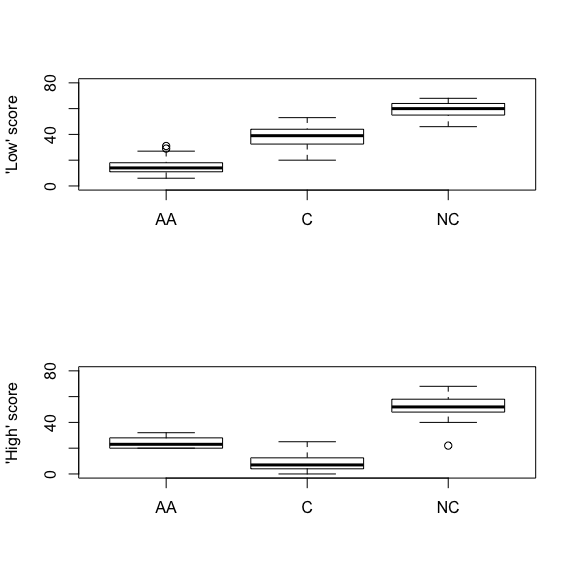
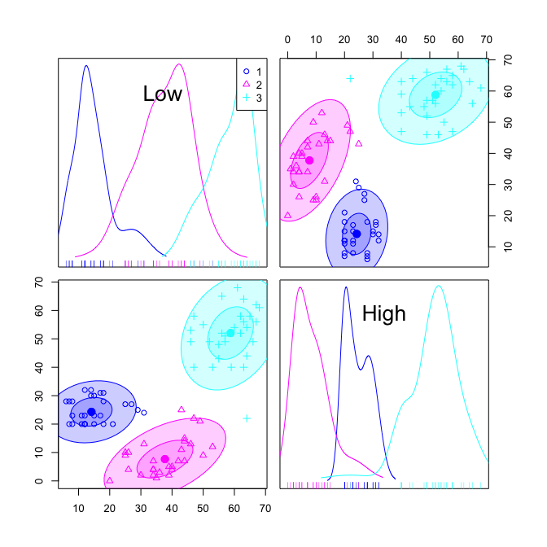
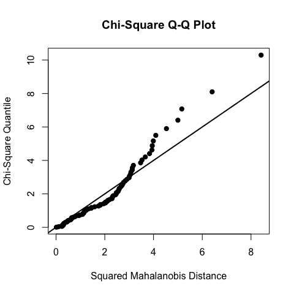

 *Multivariate Analysis for the Behavioral Sciences*  
 **Grouped Multivariate Data**
================
Kimmo Vehkalahti, Brian S. Everitt; edited by C.-F. Sheu
12 September, 2019

``` r
# check to see if the pacman package is there
# if not install it and then use it manage packages
if (!require(pacman)) install.packages("pacman")
pacman::p_load(tidyverse, car, MVN)
```

## Risk Taking Behavior

Students were randomly assigned to three different direction treatments
known as Arnold and Arnold (AA), Coombs (C), and Coombs with no penalty
(NC) in the direction. Using the three treatment conditions, students
were administered two parallel forms of a test given under low and high
penalty. The question of interest here is whether the two-dimensional
population mean vectors for the three groups are the
same.

## Table 18.4: Data from Risk Taking Behavior Study

``` r
fLoc <- "https://raw.githubusercontent.com/KimmoVehkalahti/MABS/master/Examples/data/Timm.csv"
dta <- read.csv(fLoc)
```

``` r
str(dta)
```

    'data.frame':   86 obs. of  3 variables:
     $ Group: int  1 1 1 1 1 1 1 1 1 1 ...
     $ Low  : int  8 18 8 12 15 12 12 18 29 6 ...
     $ High : int  28 28 23 20 30 32 20 31 25 28 ...

``` r
head(dta, n = 10)
```

``` 
   Group Low High
1      1   8   28
2      1  18   28
3      1   8   23
4      1  12   20
5      1  15   30
6      1  12   32
7      1  12   20
8      1  18   31
9      1  29   25
10     1   6   28
```

``` r
tail(dta, n = 10)
```

``` 
   Group Low High
77     3  65   58
78     3  46   53
79     3  46   49
80     3  47   40
81     3  64   22
82     3  64   54
83     3  63   64
84     3  63   56
85     3  64   44
86     3  63   40
```

``` r
aggregate(cbind(Low, High) ~ Group, data = dta, FUN = mean)
```

``` 
  Group    Low    High
1     1 14.897 24.6897
2     2 37.607  8.6071
3     3 58.448 51.3793
```

``` r
aggregate(cbind(Low, High) ~ Group, data = dta, FUN = var)
```

``` 
  Group    Low   High
1     1 43.239 19.007
2     2 72.396 42.396
3     3 45.756 91.815
```

## Figure 18.4

``` r
par(mfrow=c(2,1))
treatments <- c("AA", "C", "NC")
ylim <- c(0, 80)
with(dta, {
boxplot(Low[Group==1], Low[Group==2], Low[Group==3], 
        names = treatments, ylab = "'Low' score",  ylim = ylim)
  boxplot(High[Group==1], High[Group==2], High[Group==3], 
        names = treatments, ylab = "'High' score", ylim = ylim)
})
```



``` r
car::scatterplotMatrix(~ Low + High | Group, data = dta,
                       ellipse = TRUE, regLine = FALSE, smooth = FALSE)
```



## Table 18.5

``` r
dta_maov <- manova(cbind(Low, High) ~ Group, data = dta)
summary(dta_maov, test = "Pillai")
```

``` 
          Df Pillai approx F num Df den Df Pr(>F)
Group      1  0.866      268      2     83 <2e-16
Residuals 84                                     
```

``` r
summary(dta_maov, test = "Wilks")
```

``` 
          Df Wilks approx F num Df den Df Pr(>F)
Group      1 0.134      268      2     83 <2e-16
Residuals 84                                    
```

``` r
summary(dta_maov, test = "Hotelling")
```

``` 
          Df Hotelling-Lawley approx F num Df den Df Pr(>F)
Group      1             6.47      268      2     83 <2e-16
Residuals 84                                               
```

``` r
summary(dta_maov, test = "Roy")
```

``` 
          Df  Roy approx F num Df den Df Pr(>F)
Group      1 6.47      268      2     83 <2e-16
Residuals 84                                   
```

## Figure 18.5

``` r
MVN::mvn(residuals(dta_maov), multivariatePlot = "qq")
```



    $multivariateNormality
                 Test         Statistic            p value Result
    1 Mardia Skewness   4.9181826253854  0.295795960642126    YES
    2 Mardia Kurtosis -1.95971735455843 0.0500288355814869    YES
    3             MVN              <NA>               <NA>    YES
    
    $univariateNormality
              Test  Variable Statistic   p value Normality
    1 Shapiro-Wilk    Low       0.9886   0.659      YES   
    2 Shapiro-Wilk   High       0.8942  <0.001      NO    
    
    $Descriptives
          n        Mean Std.Dev   Median     Min    Max     25th    75th
    Low  86 -1.4712e-16  7.2461 -0.20088 -16.977 16.023  -4.0888  5.2474
    High 86 -9.2950e-16 15.5678  4.89134 -28.453 26.202 -16.2035 12.2017
              Skew Kurtosis
    Low   0.014475 -0.55662
    High -0.491109 -1.19394

## References

Korkmaz, S., Goksuluk, D., & Zararsiz, G. (2014). MVN: An R Package for
Assessing Multivariate Normality. *The R Journal*. 6(2), 151-162.
[Webpage](http://www.biosoft.hacettepe.edu.tr/MVN/)

Timm, N.H. (2002). *Applied Multivariate Analysis*. Springer, New York.
<https://doi.org/10.1007/b98963>

## Session information
