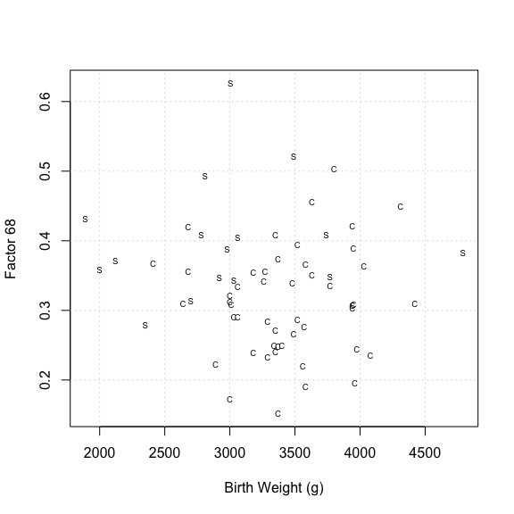
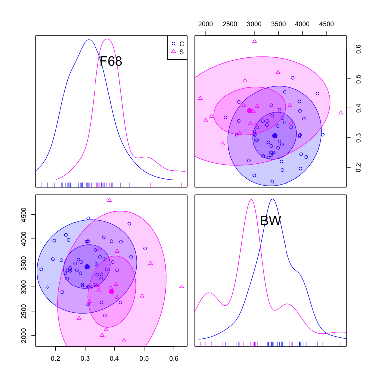
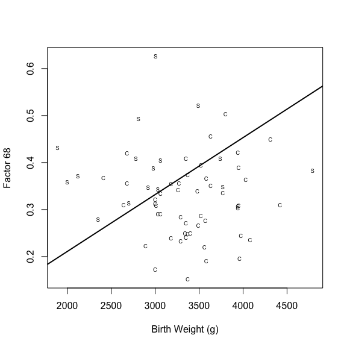

 *Multivariate Analysis for the Behavioral Sciences,*  
 **Examples of Chapter 18:**  
 **Grouped Multivariate Data**
================
Kimmo Vehkalahti, Brian S. Everitt; edited by C.-F. Sheu
11 September, 2019

``` r
# check to see if the pacman package is there
# if not install it and then use it manage packages
if (!require(pacman)) install.packages("pacman")
pacman::p_load(tidyverse, car, multicon)
```

## Sudden Infant Death (SID) Syndrome

In an investigation of sudden infant death syndrome , our variables were
recorded for each of 16 babies who were victims of SID and for 49
control babies. The babies who died and the control babies all had a
gestational age of 37 weeks or more. The factor 68 variable arises from
a particular aspect of 24h recordings or electrocardiograms and
respiratory movements made for each child; the SID victims and the
controls were matched for age at which these recordings were made. Here,
interest lies in deriving a classification rule that could use
measurements of the four variables on babies to be able to identify
children at risk of SID and, if possible, take appropriate action to
prevent the death of the
baby.

# Table 18.2: SIDs Data

``` r
fLoc <- "https://raw.githubusercontent.com/KimmoVehkalahti/MABS/master/Examples/data/sid.csv"
sid <- read.csv(fLoc)
```

``` r
sid$Group <- as.factor(ifelse(sid$Group==1, "C", "S"))
glimpse(sid)
```

    Observations: 65
    Variables: 5
    $ Group <fct> C, C, C, C, C, C, C, C, C, C, C, C, C, C, C, C, C, C, C, C…
    $ HR    <dbl> 115.6, 108.2, 114.2, 118.8, 76.9, 132.6, 107.7, 118.2, 126…
    $ BW    <int> 3060, 3570, 3950, 3480, 3370, 3260, 4420, 3560, 3290, 3010…
    $ F68   <dbl> 0.291, 0.277, 0.390, 0.339, 0.248, 0.342, 0.310, 0.220, 0.…
    $ GA    <int> 39, 40, 41, 40, 39, 40, 42, 40, 38, 40, 40, 40, 40, 38, 42…

``` r
knitr::kable(sid[45:54, ])
```

|    | Group |    HR |   BW |   F68 | GA |
| -- | :---- | ----: | ---: | ----: | -: |
| 45 | C     | 108.2 | 3000 | 0.321 | 37 |
| 46 | C     | 131.1 | 4310 | 0.450 | 40 |
| 47 | C     | 129.7 | 3975 | 0.244 | 40 |
| 48 | C     | 142.0 | 3000 | 0.173 | 40 |
| 49 | C     | 145.5 | 3940 | 0.304 | 41 |
| 50 | S     | 139.7 | 3740 | 0.409 | 40 |
| 51 | S     | 121.3 | 3005 | 0.626 | 38 |
| 52 | S     | 131.4 | 4790 | 0.383 | 40 |
| 53 | S     | 152.8 | 1890 | 0.432 | 38 |
| 54 | S     | 125.6 | 2920 | 0.347 | 40 |

## Figure 18.2

``` r
with(sid, plot(BW, F68, 
               xlab = "Birth Weight (g)", 
               ylab = "Factor 68", type = "n"))
grid()
with(sid, text(BW, F68, labels = Group, cex = .6))
```



``` r
#legend("topright", c("Controls", "SID victims"), pch = c("1", "2"))
```

``` r
car::scatterplotMatrix(~ F68 + BW | Group, data = sid,
                       ellipse = TRUE, regLine = FALSE, smooth = FALSE)
```



## Table 18.3

``` r
# Find discriminant function manually using only BW and F68:
sid1 <- sid[sid$Group == "C", -c(1, 2, 5)]
sid2 <- sid[sid$Group == "S", -c(1, 2, 5)]
m1 <- apply(sid1, 2, mean)
m2 <- apply(sid2, 2, mean)
S1 <- var(sid1)
S2 <- var(sid2)
n1 <- length(sid1[, 1])
n2 <- length(sid2[, 1])
S <- ((n1-1)*S1+(n2-1)*S2)/(n1+n2-2)
a <- solve(S)%*%(m1-m2)
z1 <- sum(a*m1)
z2 <- sum(a*m2)
z <- 0.5*(z1+z2)
```

``` r
# results of the Table briefly (could be more verbose):
m1; m2
```

``` 
        BW        F68 
3437.85714    0.31082 
```

``` 
        BW        F68 
2964.68750    0.40181 
```

``` r
S1; S2
```

``` 
            BW       F68
BW  1.9527e+05 3.2444940
F68 3.2445e+00 0.0058422
```

``` 
            BW       F68
BW  5.4530e+05 7.7596042
F68 7.7596e+00 0.0072746
```

``` r
S
```

``` 
            BW       F68
BW  2.7861e+05 4.3195203
F68 4.3195e+00 0.0061833
```

``` r
a
```

``` 
           [,1]
BW    0.0019476
F68 -16.0770541
```

``` r
z1; z2; z
```

    [1] 1.6984

    [1] -0.68605

    [1] 0.50619

``` r
# (mis)classification table:
sid_ldf <- MASS::lda(Group ~ BW + F68 + HR + GA, 
                     data = sid, prior = c(0.5, 0.5))
table(sid$Group, predict(sid_ldf)$class)
```

``` 
   
     C  S
  C 41  8
  S  3 13
```

So, the (too optimistic) percentage of misclassifications is
\((100\times(8+3)/65) \%\) = 16.9%.

## Figure 18.3

``` r
with(sid, plot(BW, F68, 
               xlab = "Birth Weight (g)", 
               ylab = "Factor 68", type = "n"))
with(sid, text(BW, F68, labels = Group, cex = .6))
slope <- -a[1]/a[2]
intercept <- z/a[2]
abline(a=intercept, b=slope, lwd=2)
```



``` r
#legend("topleft", c("Controls", "SID victims"), pch = c("1", "2"))
```

## Reference

Spicer, C.C., Lawrence, C.J., & Southall, D.P. (1987). Statistical
analysis of heart rates and subsequent victims of sudden infant death
syndrome. *Statistics in Medicine*, 6, 159–166. (Appendix II, p.165)
<https://doi.org/10.1002/sim.4780060208>

## Session information
