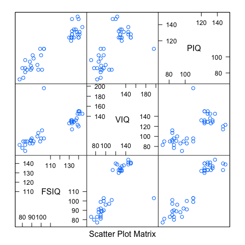
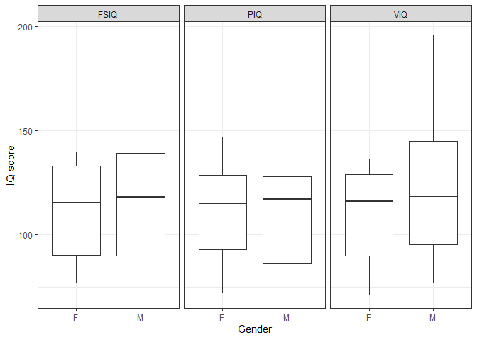
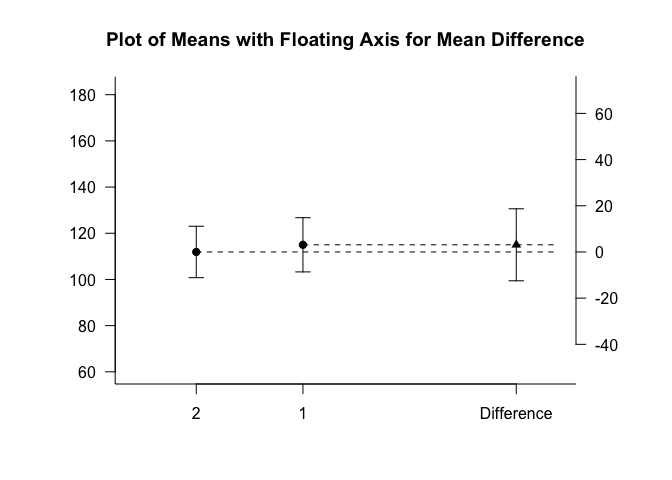
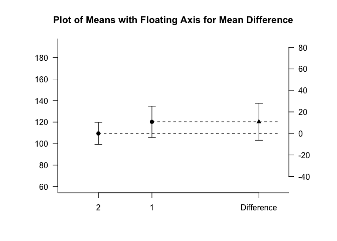
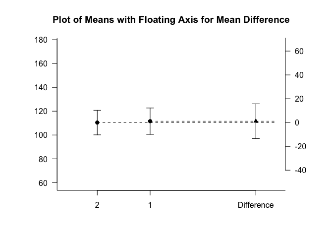

 *Multivariate Analysis for the Behavioral Sciences*  
 **Examples of Chapter 18:**  
 **Grouped Multivariate Data**
================
Kimmo Vehkalahti, Brian S. Everitt; edited by C.-F. Sheu
11 September, 2019

``` r
# check to see if the pacman package is there
# if not install it and then use it manage packages
if (!require(pacman)) install.packages("pacman")
pacman::p_load(tidyverse, survey, ICSNP, Hotelling, multicon)
```

## Example: Wechsler Adult Intelligence Scale-Revised Test (WAISRT)

Data were collected on 20 male and 20 female right-handed Anglo
psychology students at a large university in the United States. The
subjects took three subtests of the Wechsler Adult Intelligence
Scale-Revised test. The scores recorded were full-scale IQ (FSIQ),
verbal IQ (VIQ), and performance IQ
(PIQ).

## Table 18.1: WAISRT Scores for Men and Women

``` r
fLoc <- "https://raw.githubusercontent.com/KimmoVehkalahti/MABS/master/Examples/data/iq.csv"
iq_scores <- read.csv(fLoc)
```

``` r
glimpse(iq_scores)
```

    Observations: 40
    Variables: 3
    $ FSIQ <int> 140, 139, 133, 89, 133, 141, 135, 100, 80, 83, 97, 139, 141…
    $ VIQ  <int> 150, 123, 129, 93, 114, 150, 129, 96, 77, 83, 107, 145, 145…
    $ PIQ  <int> 124, 150, 128, 84, 147, 128, 124, 102, 86, 86, 84, 128, 131…

``` r
head(iq_scores)
```

``` 
  FSIQ VIQ PIQ
1  140 150 124
2  139 123 150
3  133 129 128
4   89  93  84
5  133 114 147
6  141 150 128
```

``` r
tail(iq_scores)
```

``` 
   FSIQ VIQ PIQ
35   77  83  72
36  130 126 124
37  133 126 132
38   83  90  81
39  133 129 128
40   88  86  94
```

``` r
# number of men, number of women, number of variables
n1 = 20; n2 = 20; q = 3
# group labels: 20 each
sex <- as.factor(rep(c('M', 'F'), c(n1, n2)))
```

``` r
# Hotelling's T2 test
# group mean vectors and covariances
m1 <- apply(iq_scores[sex=='M', ], 2, mean)
m2 <- apply(iq_scores[sex=='F', ], 2, mean)
S1 <- var(iq_scores[sex=='M', ])
S2 <- var(iq_scores[sex=='F', ])
# pooled covariance
S <- ((n1-1)*S1 + (n2-1)*S2) / (n1+n2-2)
# Hotelling's T-square
T2 <- t(m1-m2) %*% solve(S) %*% (m1-m2)
# T-square to F
F <- (n1+n2-q-1)*T2/((n1+n2-2)*q)
# F to p-value, one-sided
pvalue <- 1 - pf(F, q, n1+n2-q-1)
# output as list
list(T2=as.numeric(T2), F=as.numeric(F), pvalue=as.numeric(pvalue)) 
```

    $T2
    [1] 0.27073
    
    $F
    [1] 0.085492
    
    $pvalue
    [1] 0.96753

Quoting our own text on p.367:

Here, Hotelling’s \(T^2\) takes the value 0.27, with the corresponding
\(F\)-statistic being 0.09, having 3 and 36 degrees of freedom; the
associated \(p\)-value is 0.97. There is no evidence of a gender
difference on the three measures of IQ.

The following sections do not appear in the textbook.

## HotellingsT2{ICSNP}

``` r
Y <- as.matrix(iq_scores[,1:3])
ICSNP::HotellingsT2(Y ~ sex)
```

``` 

    Hotelling's two sample T2-test

data:  Y by sex
T.2 = 0.855, df1 = 3, df2 = 36, p-value = 0.47
alternative hypothesis: true location difference is not equal to c(0,0,0)
```

## Data Visualization

``` r
lattice::splom(~iq_scores[,1:3])
```



``` r
# create gender group ID and subject ID
# convert from wide to long format
iq_scores$Gender <- as.factor(sex)
iq_scores$ID <- as.factor(paste0("S", 101:140))
iqL <- iq_scores %>% gather(key = iq, value = score, 1:3)
```

``` r
glimpse(iqL)
```

    Observations: 120
    Variables: 4
    $ Gender <fct> M, M, M, M, M, M, M, M, M, M, M, M, M, M, M, M, M, M, M, …
    $ ID     <fct> S101, S102, S103, S104, S105, S106, S107, S108, S109, S11…
    $ iq     <chr> "FSIQ", "FSIQ", "FSIQ", "FSIQ", "FSIQ", "FSIQ", "FSIQ", "…
    $ score  <int> 140, 139, 133, 89, 133, 141, 135, 100, 80, 83, 97, 139, 1…

``` r
ggplot(iqL, aes(Gender, score)) +
 geom_boxplot() +
 facet_grid(. ~ iq) +
 labs(x = "Gender", y = "IQ score") +
 theme_bw()
```



## Multiple t-tests

``` r
lapply(iq_scores[, c("FSIQ", "VIQ", "PIQ")], 
       function(x) t.test(x ~ iq_scores$Gender, var.equal = TRUE))
```

    $FSIQ
    
        Two Sample t-test
    
    data:  x by iq_scores$Gender
    t = -0.403, df = 38, p-value = 0.69
    alternative hypothesis: true difference in means is not equal to 0
    95 percent confidence interval:
     -18.685  12.485
    sample estimates:
    mean in group F mean in group M 
              111.9           115.0 
    
    
    $VIQ
    
        Two Sample t-test
    
    data:  x by iq_scores$Gender
    t = -1.28, df = 38, p-value = 0.21
    alternative hypothesis: true difference in means is not equal to 0
    95 percent confidence interval:
     -27.8846   6.2846
    sample estimates:
    mean in group F mean in group M 
             109.45          120.25 
    
    
    $PIQ
    
        Two Sample t-test
    
    data:  x by iq_scores$Gender
    t = -0.16, df = 38, p-value = 0.87
    alternative hypothesis: true difference in means is not equal to 0
    95 percent confidence interval:
     -15.718  13.418
    sample estimates:
    mean in group F mean in group M 
             110.45          111.60 

``` r
lapply(iq_scores[, c("FSIQ", "VIQ", "PIQ")], 
       function(x) diffPlot(x ~ iq_scores$Gender, 
                            ylab = "", xlab = "",
                            main = "Plot of Means with Floating Axis for Mean Difference"))
```



    $FSIQ
    [1] 1 2 4
    
    $VIQ
    [1] 1 2 4
    
    $PIQ
    [1] 1 2 4

## Reference

Willerman, L., Schultz, R., Rutledge, J.N. & Bigler, E. D. (1991). In
vivo brain size and intelligence. *Intelligence*, 15, 223–228.
<https://doi.org/10.1016/0160-2896(91)90031-8>

## Session information
