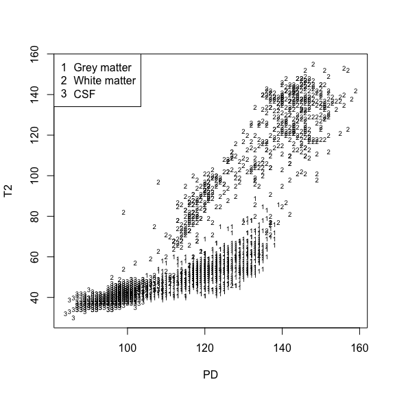
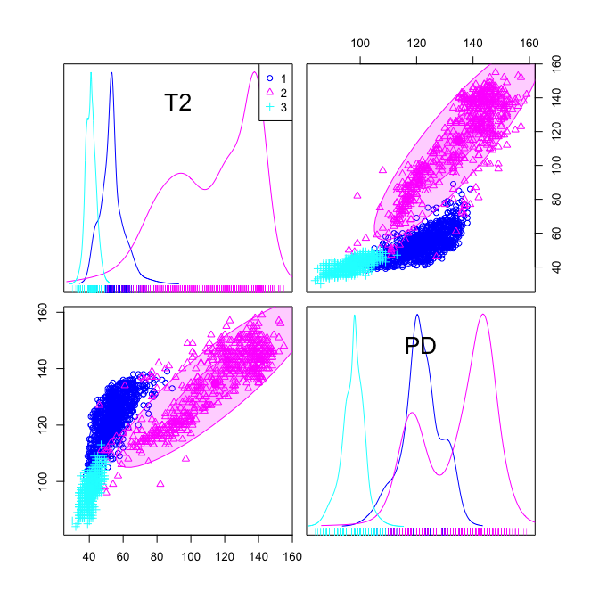
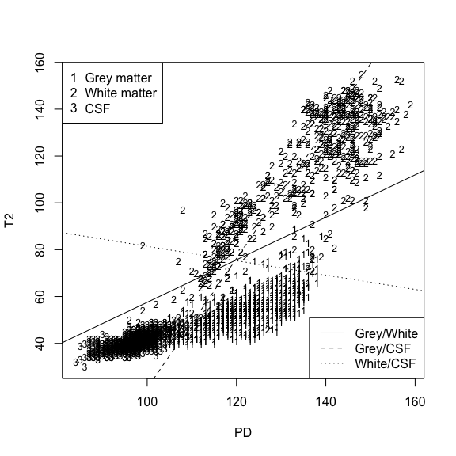

 *Multivariate Analysis for the Behavioral Sciences*  
 **Examples of Chapter 18:**  
 **Grouped Multivariate Data**
================
Kimmo Vehkalahti, Brian S. Everitt; edited by C.-F. Sheu
12 September, 2019

``` r
# check to see if the pacman package is there
# if not install it and then use it manage packages
if (!require(pacman)) install.packages("pacman")
pacman::p_load(tidyverse, car, MVA)
```

## Functional Magnetic Resonance Imaging (fMRI)

Two measures of intensity of each voxel in an image were recorded: PD
(Proton Density) and T2 (T2 weighted). One aim of the investigation was
to derive a rule for allocating each voxel in an image into one of three
classes: grey matter, white matter, or cerebrospinal fluid (CSF). When
more than two groups are involved, we can again derive classification
functions by comparing the assumed multivariate normal densities for
each group.

# Table 18.6: fMRI Data

The textbook uses only 50 observations from a larger data set with 2,836
observations.

``` r
#fLoc <- "https://raw.githubusercontent.com/KimmoVehkalahti/MABS/master/Examples/data/fMRI.csv"
#fMRI <- read.csv(fLoc)
```

``` r
temp <- tempfile()
download.file("http://www.gllamm.org/books/data.zip",temp)
fMRI <- read.table(unz(temp, "IMAGE.DAT"), header = TRUE)
unlink(temp)
```

``` r
str(fMRI)
```

    'data.frame':   2836 obs. of  3 variables:
     $ PD   : int  105 109 115 120 123 122 108 110 117 120 ...
     $ T2   : int  51 53 60 62 60 60 53 57 60 58 ...
     $ Class: int  1 1 1 1 1 1 1 1 1 1 ...

``` r
head(fMRI)
```

``` 
   PD T2 Class
1 105 51     1
2 109 53     1
3 115 60     1
4 120 62     1
5 123 60     1
6 122 60     1
```

``` r
tail(fMRI)
```

``` 
      PD T2 Class
2831 100 44     3
2832 102 49     3
2833 101 49     3
2834 102 47     3
2835 104 43     3
2836 102 41     3
```

``` r
# How many observations in each group
knitr::kable(with(fMRI, table(Class)))
```

| Class | Freq |
| :---- | ---: |
| 1     | 1127 |
| 2     |  586 |
| 3     | 1123 |

``` r
aggregate(cbind(PD, T2) ~ Class, data =fMRI, FUN = mean);
```

``` 
  Class     PD      T2
1     1 121.60  53.563
2     2 134.30 112.222
3     3  97.43  40.920
```

``` r
aggregate(cbind(PD, T2) ~ Class, data =fMRI, FUN = var)
```

``` 
  Class      PD       T2
1     1  54.349  53.8751
2     2 169.531 670.2481
3     3  16.486   9.4018
```

## Figure 18.6

``` r
with(fMRI, plot(T2 ~ PD, type = "n", pch = Class, 
     xlab = "PD", ylab = "T2"))
with(fMRI, text(PD, T2, labels = Class, cex=0.6))
legend("topleft", c("Grey matter", "White matter", "CSF"), 
       pch = c("1", "2", "3"))
```



``` r
car::scatterplotMatrix(~ T2 + PD | Class, data = fMRI,
                       ellipse = TRUE, regLine = FALSE, smooth = FALSE)
```



## Table 18.7

``` r
Class <- fMRI$Class
# calculate means of each class
m1 <- apply(fMRI[Class==1, -3], 2, mean)
m2 <- apply(fMRI[Class==2, -3], 2, mean)
m3 <- apply(fMRI[Class==3, -3], 2, mean)

# numbers in each class
n1 <- length(fMRI[Class==1, 1])
n2 <- length(fMRI[Class==2, 1])
n3 <- length(fMRI[Class==3, 1])

# covariance matrices
S1 <- (n1-1)*var(fMRI[Class==1, -3])/(n1-1)
S2 <- (n2-1)*var(fMRI[Class==2, -3])/(n2-1)
S3 <- (n3-1)*var(fMRI[Class==3, -3])/(n3-1)

# pooled covariance matrix
S123 <- ((n1-1)*var(fMRI[Class==1, -3]) + 
         (n2-1)*var(fMRI[Class==2, -3]) +
         (n3-1)*var(fMRI[Class==3,-3])) / (n1+n2+n3-3)

# results briefly:
m1; m2; m3
```

``` 
     PD      T2 
121.600  53.563 
```

``` 
    PD     T2 
134.30 112.22 
```

``` 
   PD    T2 
97.43 40.92 
```

``` r
c(n1, n2, n3)
```

    [1] 1127  586 1123

``` r
S1; S2; S3
```

``` 
       PD     T2
PD 54.349 37.982
T2 37.982 53.875
```

``` 
       PD     T2
PD 169.53 286.82
T2 286.82 670.25
```

``` 
        PD     T2
PD 16.4860 7.9267
T2  7.9267 9.4018
```

``` r
S123
```

``` 
       PD      T2
PD 63.138  77.463
T2 77.463 163.539
```

## Table 18.8

``` r
# coefficients for each classification class
invS <- solve(S123)
a1 <- invS%*%(m1-m2)
a2 <- invS%*%(m1-m3)
a3 <- invS%*%(m2-m3)

# thresholds
z12 <- (m1%*%a1+m2%*%a1)/2
z13 <- (m1%*%a2+m3%*%a2)/2
z23 <- (m2%*%a3+m3%*%a3)/2

# results (very) briefly:
a1; a2; a3
```

``` 
       [,1]
PD  0.57056
T2 -0.62894
```

``` 
       [,1]
PD  0.68747
T2 -0.24833
```

``` 
      [,1]
PD 0.11691
T2 0.38062
```

``` r
z12; z13; z23
```

``` 
       [,1]
[1,] 20.868
```

``` 
       [,1]
[1,] 63.558
```

``` 
      [,1]
[1,] 42.69
```

## Figure 18.7

``` r
# code from previous figure:
with(fMRI, plot(T2 ~ PD, type = "n", pch = Class, 
     xlab = "PD", ylab = "T2"))
with(fMRI, text(PD, T2, labels = Class, cex=0.8))
legend("topleft", c("Grey matter", "White matter", "CSF"), 
       pch = c("1", "2", "3"))

# add discriminant functions
abline(z12/a1[2], -a1[1]/a1[2])
abline(z13/a2[2], -a2[1]/a2[2], lty=2)
abline(z23/a3[2], -a3[1]/a3[2], lty=3)
legend("bottomright", c("Grey/White", "Grey/CSF", "White/CSF"), lty=1:3)
```



## Reference

Everitt, B., & Rabe-Hesketh, S. (2001). *Analyzing Medical Data using
S-PLUS* Springer.

## Session information
